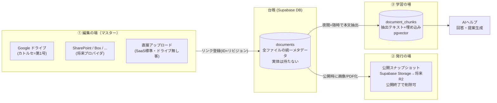
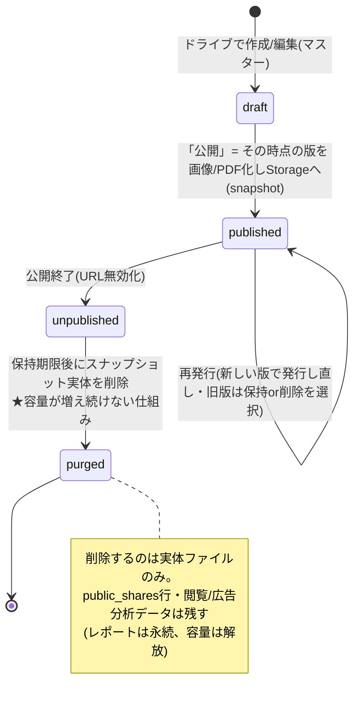
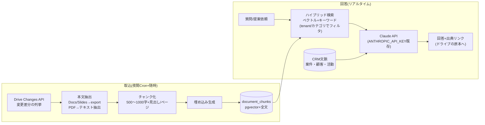

# 設計書: 統合ドキュメント基盤 — マルチストレージ連携・共有ドライブ運用・発行物・AIヘルプ（2026-07-25）

> **ステータス**: 実装前設計（**残論点4件すべて決定済み** — §7末尾参照。実装着手可）
> **決定済みの方針**（2026-07-25 ディスカッション合意）:
> 1. **マスターは顧客のファイルサーバー**。SaaSとして様々なストレージと連携できるアダプタ構造とし、**第1号プロバイダ = Google ドライブ**（カトルセの運用実態）
> 2. **公開プレゼン資料は「発行物」**＝リンクではなくスナップショット複製。公開終了後は実体ファイルを削除できる運用にし、容量が際限なく増えない構造にする
> 3. カトルセ本部が**アクセス権を制御した共有ドライブ**を営業・バックオフィスに公開し、担当者が自分で格納できる運用を設計に含める
> 4. **AIヘルプ機能**（営業資料・技術資料を元にAIが回答・提案）を、リンク方式のまま成立させる
>
> **関連文書**: `INFRA_ANALYSIS_VERCEL_SUPABASE_2026-07.md` / `STORAGE_ANALYSIS_FILES_2026-07.md`（実測に基づく前提）

---

## 0-a. 運用モデル改訂（2026-07-26 合意・P1.5実装済み）

当初案の「全ファイルを新設ドライブ(601〜603)へ集約」は、既存の共有ドライブ運用
（開発者・パートナーとのプロジェクト共有）と衝突するため廃止。以下に改める:

| 場 | 実体 | 役割 |
|---|---|---|
| **作業場** | 既存の全共有ドライブ（100_社内共有、600_パートナー協業、案件フォルダ等） | 今まで通り。何も変えない。CRMへは**どこにあってもURLでリンク可** |
| **図書館** | 601_CRM_資料庫 | 全ファイルの置き場ではなく「完成した会社資産の納品先」。AI学習コーパス |
| **金庫** | 603_CRM_BO | 機微情報の隔離（変更なし） |

**ファイルの入口は2つ**（ユーザーがSupabaseを意識する場面はゼロ）:
1. **CRMでアップロード**: ファイル+種別を選ぶだけ。CRMが種別からドライブの所定フォルダへ自動振り分けて保存（マスター=ドライブ）。証跡種別（契約書類=強制、提案書=既定ON）は**Supabaseへ静止点（凍結コピー）も自動保存**。ブラウザ→Drive直接アップロード(resumable)のため**Vercelの4.5MB制限の影響を受けない**
2. **URLリンク貼り付け**: ドライブ上の既存ファイルをどこからでも紐付け（実体コピーなし）

**AI学習対象**（§5の改訂）: ①601の全ファイル ②**CRMにリンクされた全ファイル**（場所不問。人が紐付けた=業務関連というキュレーション信号）。除外は「種別が契約書類/請求/人事」+「603に置きリンクしない」+個別excluded指定。

**残る唯一の場所ルール**: 個人マイドライブの私物はリンクしない（他メンバーが開けない・組織接続から見えないため）。

## 0. 設計原則 — 3つの「場」と1つの台帳



| 原則 | 内容 |
|---|---|
| **リンク優先** | ファイル実体はマスター側に1つ。CRM/Codexは `documents` 台帳にID・リビジョン・メタデータのみ保持 |
| **複製は2例外のみ** | (a) 発行物（公開スナップショット。編集と切り離すことが目的）(b) 証跡固定 = **契約書・注文書・検収書+顧客提出済み提案書の最終版**（2026-07-25決定。渡した時点の保全が必要な書類） |
| **学習は派生データ** | ファイルのコピーではなく抽出テキスト+埋め込み。マスター更新に追従して再生成 |
| **プロバイダは差替可能** | アプリはStorageProviderインターフェースのみに依存。Googleドライブ固有コードはアダプタ内に閉じる |
| **テナント単位の接続** | どのストレージと繋ぐかはテナント設定（SaaSでは顧客ごとに異なる前提） |

---

## 1. データモデル設計

### 1.1 `documents` — 全ファイルの統一台帳（新規）

既存の `attachments`（実体アップロード前提）を包含する上位概念。**既存テーブルは壊さず、新テーブルを追加して段階移行**（本リポジトリのadditive原則に従う）。

```sql
create table documents (
  id            uuid primary key default gen_random_uuid(),
  tenant_id     uuid not null references tenants(id) on delete cascade,

  -- どこにあるか
  source_type   text not null check (source_type in (
                  'link',       -- 外部ストレージへのリンク(マスターは向こう) ★推奨デフォルト
                  'upload',     -- Supabase Storageへの直接アップロード(ドライブ無し客/顧客受領ファイル)
                  'snapshot'    -- 発行物・証跡固定(不変・削除ポリシー対象)
                )),
  provider      text not null default 'gdrive',   -- 'gdrive' | 'supabase' | 'sharepoint' | 'box' ...
  external_id   text,          -- Drive fileId 等(link時)
  external_rev  text,          -- Drive revisionId / headRevisionId(リンク先の版の追跡)
  storage_path  text,          -- upload/snapshot時のバケット内パス
  web_url       text,          -- 人間が開くURL(DriveのwebViewLink等)

  -- 何のファイルか
  title         text not null,
  mime_type     text,
  size_bytes    bigint,
  category      text,          -- '提案書'|'企画書'|'研修資料'|'技術資料'|'契約書類'|... (§3のフォルダ規約と対応)
  tags          text[] not null default '{}',
                -- ★タグはCRM側で管理する(2026-07-25決定: ドライブはフラット構造+CRMタグ付け)
                -- 自動付与: category(フォルダ由来)/顧客名(accounts照合)/商材(products照合)
                -- +インデックス時のAI提案タグ、手動編集可。検索・AI回答の絞り込みに使用

  -- どこに紐づくか(既存attachmentsのtarget_type/target_idを踏襲・拡張)
  target_type   text,          -- 'opportunity'|'account'|'project'|'knowledge'|'library'(紐付けなしの資料庫)
  target_id     uuid,

  -- 学習・ライフサイクル
  index_status  text not null default 'pending'
                check (index_status in ('pending','indexed','failed','skipped','excluded')),
                -- excluded = 学習対象外(機密・人事等)。カテゴリ/フォルダ単位の既定+個別上書き
  indexed_rev   text,          -- 最後にインデックスした版(external_revと比較して差分検知)
  link_status   text not null default 'ok'
                check (link_status in ('ok','moved','forbidden','deleted')),  -- 夜間ヘルスチェックが更新
  retention     text,          -- 'keep' | 'purge_after_unpublish' | 'purge_at:<date>' (snapshot用)

  created_by    uuid references auth.users(id),
  created_at    timestamptz not null default now(),
  updated_at    timestamptz not null default now()
);
-- RLS: 既存パターン踏襲 (tenant_id in (select current_tenant_ids())、書込は can_edit_role)
```

**設計判断のポイント**:
- `source_type='link'` はサイズ0円。`upload`/`snapshot` のみがStorage容量を消費 → 容量管理は「snapshotの棚卸し」だけ見ればよくなる
- `external_rev` を持つことで「公開した版」「学習した版」がマスターの現在版とズレているかを機械的に検知できる（発行物の再発行提案・インデックスの差分更新の両方の基礎）
- `category` はGoogleドライブのフォルダ規約（§3）と1:1対応させ、**取込時に自動判定**する

### 1.2 `tenant_storage_connections` — テナント毎のストレージ接続（新規・SaaSの核）

```sql
create table tenant_storage_connections (
  id             uuid primary key default gen_random_uuid(),
  tenant_id      uuid not null references tenants(id) on delete cascade,
  provider       text not null,             -- 'gdrive' | 'sharepoint' | 'box' | ...
  display_name   text not null,             -- 「カトルセ営業共有ドライブ」等
  auth_kind      text not null check (auth_kind in ('oauth_user','oauth_org','service_account')),
  credentials    text,                      -- 暗号化済みトークン(既存 crypto-mail.ts の encryptSecret を流用)
  config         jsonb not null default '{}',
                 -- gdrive: { sharedDriveIds: [...], indexRootFolderIds: [...],
                 --           excludeFolderIds: [...], pickerEnabled: true }
  status         text not null default 'active',   -- 'active'|'error'|'revoked'
  created_at     timestamptz not null default now(),
  unique (tenant_id, provider, display_name)
);
```

- **カトルセの初期設定**: `provider='gdrive'`, `auth_kind='oauth_org'`（管理者が組織代表アカウントで接続。インデックスバッチ・リンクヘルスチェックはこの資格情報で共有ドライブを読む）
- **個々の担当者のPicker操作**は各自のGoogleアカウントOAuth（既存 `google-oauth.ts` のフローを流用しスコープ追加）— 自分に権限のあるファイルしか選べない、が自然に担保される
- SaaS外販時: 顧客管理者が自社のストレージを接続する画面（この行を作るUI）が「連携機能」という商品になる

### 1.3 学習インデックス（§5で詳述）

```sql
create extension if not exists vector;   -- pgvector(Supabase対応済み)

create table document_chunks (
  id           uuid primary key default gen_random_uuid(),
  tenant_id    uuid not null references tenants(id) on delete cascade,
  document_id  uuid not null references documents(id) on delete cascade,
  chunk_no     int not null,
  content      text not null,             -- 抽出テキスト(1チャンク≒500〜1000字)
  embedding    vector(1024),              -- 埋め込み(モデルは§5.3)
  meta         jsonb not null default '{}',  -- {page, heading, category, rev}
  created_at   timestamptz not null default now(),
  unique (document_id, chunk_no)
);
create index on document_chunks using hnsw (embedding vector_cosine_ops);
-- + content への全文検索インデックス(§5.3 ハイブリッド検索)
```

---

## 2. StorageProvider アダプタ設計

### 2.1 インターフェース（`src/lib/storage/provider.ts`）

```typescript
export interface StorageProvider {
  readonly kind: string;  // 'gdrive' | 'supabase' | ...

  /** リンク登録: Picker等で選ばれたファイルのメタデータを解決 */
  resolveFile(conn: Connection, externalId: string): Promise<FileMeta>;
  /** 本文取得: 学習インデックス・スナップショット生成用(export含む) */
  fetchContent(conn: Connection, externalId: string, opts?: { exportMime?: string }): Promise<ReadableStream>;
  /** 現在のリビジョン取得(差分検知・再発行提案) */
  getRevision(conn: Connection, externalId: string): Promise<string>;
  /** リンク健全性(存在・アクセス可否) */
  checkHealth(conn: Connection, externalId: string): Promise<'ok'|'moved'|'forbidden'|'deleted'>;
  /** 差分列挙: 前回チェックポイント以降の変更(インデックス増分更新用) */
  listChanges(conn: Connection, cursor: string|null): Promise<{ changes: Change[]; nextCursor: string }>;
  /** フォルダ作成(案件フォルダ自動作成 §3.3。非対応プロバイダはnull返却可) */
  ensureFolder?(conn: Connection, parentId: string, name: string): Promise<{ folderId: string; webUrl: string }>;
}
```

- アプリ本体は `getProvider(conn.provider)` 経由でのみ呼ぶ。**Google APIのimportはアダプタ内に閉じる**
- `supabase` プロバイダ（直接アップロード）も同一インターフェースで実装 → SaaS標準プランは接続設定なしで動く
- 将来のSharePoint/Box追加は「このインターフェースの実装を1ファイル足す」作業に限定される

### 2.2 Google ドライブアダプタ（第1号）の要点

| 項目 | 設計 |
|---|---|
| ファイル選択UI | **Google Picker API**。スコープは `drive.file`（Pickerで選んだファイルのみアクセス可）を基本とし、ユーザーの全ドライブを読む権限は要求しない |
| バッチ用アクセス | 組織接続（`oauth_org`）に `drive.readonly`（対象共有ドライブに限定運用）。Changes API のカーソルを `config` に保持し増分同期 |
| Google形式の扱い | ドキュメント/スライド/スプレッドシートは `files.export`（テキスト/PDF）で抽出。PDFやOffice形式は `files.get?alt=media` |
| リビジョン | `files.get(fields=headRevisionId,modifiedTime)` を `external_rev` に記録 |
| トークン保管 | 既存 `crypto-mail.ts`（AES + `MAIL_CRED_SECRET` 派生鍵）で暗号化しDB保存。既存Gmail OAuth（`google-oauth.ts`・`user_mail_accounts`）とリフレッシュ処理を共通化 |
| API制限 | Drive APIは十分な無料枠（既定 12,000リクエスト/分/プロジェクト）。夜間バッチはChanges APIベースなので全量走査しない |

---

## 3. カトルセ共有ドライブの運用設計

### 3.1 ドライブ構成と権限（2026-07-25決定: **フラット構造+CRMタグ管理**）

> 決定: 分類はドライブの深いフォルダ階層でなく**CRM側のタグ**で行う。ドライブは「浅く・少なく・迷わない」を最優先。
> 理由: フォルダ階層は人によって解釈が割れて崩壊しやすい。タグならCRM/AIが自動付与でき、検索・AI質問のヒット率を機械側で高められる。

**共有ドライブは3つだけ（マイドライブ禁止）。フォルダは各ドライブ直下の1階層のみ**。権限はGoogleグループで束ね、個人アカウント直付与は原則禁止（退職・異動時の事故防止）。

> **2026-07-25決定（外部委託の扱い）**: 外部委託の営業メンバー（組織外メールアドレス）にも**グループ経由でアクセス権を付与する**。全員をGWSドメインに収容する案は採らない（コスト・および「ドメインを統一しても個人単位の漏れ確認は結局必要」との判断）。代わりに §3.5 のガバナンス（機微情報の隔離・NDA・CRMによる自動監査）で漏れを防ぐ。

| 共有ドライブ | 直下フォルダ（この1階層のみ。サブフォルダは作らない） | 権限（Googleグループ） | AI学習 |
|---|---|---|---|
| **CATORCE-資料庫**<br>（実体: 601_CRM_資料庫） | `01_提案書` `02_企画書` `03_研修資料` `04_技術資料` `05_営業ツール` `09_テンプレート` | `sales-mgr@`: コンテンツ管理者（社内営業4名全員が所属）<br>`sales-ext@`: **投稿者**（外部委託営業）<br>`backoffice@`: 閲覧者（必要時）<br>※`sales-all@`は廃止(2026-07-25): mgr+extで営業全員をカバー | **対象** |
| **CATORCE-案件**<br>（実体: 602_CRM_案件） | `<顧客名>_<案件ID>`（CRMが自動作成。年度フォルダも作らずフラット） | `sales-mgr@`: コンテンツ管理者<br>`sales-ext@`: 投稿者<br>※協業パートナーは従来通り**案件フォルダ単位**で追加（追加はコンテンツ管理者のみ・棚卸し対象） | **対象**（案件スコープ。外部が投稿したファイルも取込まれる点に留意） |
| **CATORCE-BO**<br>（実体: 603_CRM_BO） | `01_契約書類` `02_請求` `03_人事` | `backoffice@`: 投稿者（利用開始時に追加。当面はオーナーのみ）<br>**外部・営業は追加禁止** | **対象外**（既定でexcluded） |

- **機微情報の置き場ルール**: 営業（社内外とも）に見せない情報（原価・人事・経営数値・顧客から預かった機密）は**CATORCE-BOのみ**に置く。資料庫・案件ドライブは「外部委託営業も見える場所」と全員が認識して運用する
- `sales-ext@` を `sales-all@` と分ける理由: 権限は同じでも、**棚卸し・監査・一括剥奪の単位**として外部委託を分離しておくため（契約終了時はグループから外す1操作で全ドライブから消える）

- **顧客別サブフォルダは作らない**。顧客・商材・年度はファイル名とCRMタグで表現する
- **ファイル命名規則（唯一のルール）**: `YYYYMMDD_顧客名_件名_版` 例: `20260725_ABC商事_DX研修提案_v2`
  - 日付降順で自然に並ぶ / 顧客名がCRMタグ自動付与の照合キーになる / フラットでも検索で迷わない
- **「担当者が格納できる」の実装**: 権限「投稿者(Contributor)」= 追加・編集はできるが削除・移動は管理者のみ。誤削除でCRMのリンクが死ぬ事故を構造的に減らす
- 本部（バックオフィス）はグループのメンバー管理だけで入退社・異動に対応。CRM側は何も変えなくてよい
- **フォルダ = `documents.category` の自動判定元**（1階層なので判定が単純確実）。BO配下は自動でexcluded（個別上書き可）

### 3.1b CRMタグによる分類（フラット構造の相棒）

`documents.tags` に以下を付与し、検索・AI質問時の絞り込み/ブースト（§5.2）に使う:

| タグ種 | 付与方法 | 例 |
|---|---|---|
| 種別 | フォルダから自動 | `提案書` `技術資料` |
| 顧客 | ファイル名/案件フォルダ名を `accounts` と照合して自動 | `ABC商事` |
| 商材 | 抽出テキストを `products` と照合して自動 | `DX研修` `採用支援` |
| 業界・テーマ等 | インデックス時にAIが提案（Claude）→担当者が確認/編集 | `製造業` `補助金活用` |
| 任意 | 手動 | `勝ちパターン` `社外秘` |

- タグはCRMの資料検索のファセット（絞り込みUI）とAIヘルプの検索フィルタに直結。「ABC商事向けの過去提案書から」のような質問はタグで対象を絞ってから意味検索する
- ドライブ側には何も求めない（命名規則のみ）。**分類の賢さは全部CRM/AI側が引き受ける**

### 3.2 CRMからの利用動線（担当者の日常）

1. 案件画面で「資料を添付」→ **タブ「ドライブから選ぶ」**（Picker、推奨・既定）/「アップロード」（ドライブに置けない受領ファイル等）
2. Pickerで選択 → `documents` に `source_type='link'` で登録。CRM上ではファイル名+種別バッジ+「ドライブで開く」
3. 逆方向: 「この案件のフォルダを開く」ボタン（§3.3の自動作成フォルダへ）→ ドライブ側で作業→ 夜間同期でCRMに自動出現（案件フォルダ内の新ファイルを自動で `documents` に取込）

### 3.3 案件フォルダの自動作成

- 案件作成時（または案件画面の「フォルダ作成」ボタン）に `ensureFolder()` で `CATORCE-案件/<顧客名>_<案件ID>/` を作成し、`opportunities` に `drive_folder_id` を保持
- 命名は機械可読（案件IDを含む）にし、リネームされてもIDで追跡可能

### 3.5 外部委託メンバーのガバナンス（2026-07-25決定）

外部メールアドレスへの権限付与を許容する代わりに、以下の三層で漏れを防ぐ:

**第1層: 契約と隔離（運用の前提）**
- 外部営業とは**NDA締結を必須**とし、締結記録をCRMで管理（§3.6のNDA台帳）。未締結者はグループに追加しない
- 機微情報はCATORCE-BOに隔離（§3.1）。「資料庫・案件は外部委託も見える」を全社共通認識にする

**第2層: Google側の構成（事故を起きにくくする）**
- 外部委託は必ず `sales-ext@` グループ経由（個人直付与禁止）。グループへの追加は**管理者のみ**（グループ設定で外部メンバー追加を管理者限定にする）
- 外部委託の各メンバーは自分の業務アドレス（例: @mail.catorce.jp）で**Googleアカウントを作成**して参加（手順はRunbook §1-4）
- 共有ドライブ「投稿者」権限のため削除・持出し的な一括操作は不可。ダウンロード自体はNDAで統制（Google側の技術的制限は閲覧者のみ対象のため）

**第3層: CRMによる自動監査（§3.6）** — 「人が思い出す」に頼らない仕組み化

### 3.6 CRM権限ガバナンス機能（新規機能・実装フェーズP2に追加）

「個人ごとの管理・漏れ確認はどのみち必要」という前提に立ち、CRMを権限の台帳・監査役にする:

**(a) ユーザーライフサイクル連動アラート**
- CRMの `memberships` 無効化/削除時に、**オフボーディング・チェックリスト**を自動生成（既存の `notifications`+`tasks` を流用）:
  1. Googleグループ（sales-all/sales-ext等）からの除外
  2. 案件フォルダの個別共有の剥奪
  3. メール接続（`user_mail_accounts`）・OAuthトークンの失効
  4. NDA上の返却・破棄義務の履行確認（外部委託の場合）
- チェック項目が完了処理されるまで管理者ダッシュボードに未完了警告を表示

**(b) Google権限の取込みと突合（夜間バッチ）**
- 組織接続（`tenant_storage_connections`）でDrive APIの権限情報を夜間取得し、`drive_permission_snapshots` に保存:
  - 3共有ドライブのメンバー一覧（グループ展開後の実効ユーザー）
  - 案件フォルダの個別共有（外部パートナー）一覧
- **自動チェック（違反は管理者へ通知+日次ダイジェストに掲載）**:
  | チェック | 検知する漏れ |
  |---|---|
  | 削除済み/停止済みアカウントの残存権限 | スクリーンショットで発見された「削除されたアカウント」型の残骸 |
  | CRMに存在しない人がドライブ権限を保有 | グループ外しの漏れ・勝手な直接共有 |
  | 外部アドレスの権限保有者にNDA記録がない/期限切れ | 契約ガバナンスの穴 |
  | CATORCE-BOに backoffice@ 以外の権限 | 機微情報隔離の破れ |
  | 個人直付与（グループ経由でない付与）の発生 | 規約外の共有操作 |
  | 前日比の権限差分（新規外部付与） | 気づかないうちの共有拡大 |
- 四半期の棚卸しは「このレポートを確認して承認する」作業に置き換わる（ゼロから調べる棚卸しを廃止）

**(c) NDA台帳**
- `external_agreements` テーブル: 対象者メール・種別(NDA等)・締結日・有効期限・ファイル参照（証跡固定snapshot）
- (b)の突合の照合元。期限90日前に更新アラート

### 3.7 リンク健全性の維持（リンク方式の弱点対策）

- **夜間Cron（既存基盤に1本追加）**: 全 `link` ドキュメントを `checkHealth()`（Changes APIの差分で大半はスキップ）→ `link_status` 更新
- 切れたリンクは担当者+管理者に通知（既存の通知テーブル `notifications` を流用）。CRM画面ではグレーアウト+「リンク切れ」バッジ
- 移動はDriveのファイルIDが不変なので**追跡可能**（リンク切れになるのは削除と権限剥奪のみ）

---

## 4. 発行物（公開プレゼン資料）のライフサイクル設計

### 4.1 状態遷移と容量管理



| 設計要素 | 内容 |
|---|---|
| 公開時 | `documents` に `source_type='snapshot'` の行を発行（元ファイルの `document_id`・`external_rev` を `meta` に記録 → 「どの版を公開したか」が永続追跡可能） |
| 公開終了時 | 即削除はしない。`retention='purge_after_unpublish'` + 猶予日数（既定30日、テナント設定可）。「間違えて公開終了」からの復活を許容 |
| パージ実行 | 夜間Cronが期限超過スナップショットのStorage実体を削除し、`documents` 行は `storage_path=null` で残す（台帳・分析は不滅） |
| 元ファイルの削除 | マスター（ドライブ）側の削除は**ドライブの運用に委ねる**（CRMは関知しない）。リンク切れ検知（§3.4）が「発行済みだが元は削除済み」を可視化するので、発行物があれば配布の証跡は残る — ご要望の「公開が終われば元ファイルも削除できる」運用が安全に成立 |
| 分析データ | `share_view_events` は前設計（STORAGE_ANALYSIS §3.3）通り日次集計+90日パージ。**集計行だけで広告レポートは永続提供** |

### 4.2 これで容量はどうなるか

- 増えるのは「**現在公開中のスナップショット**」のみ。公開終了+猶予経過で自動解放
- 例: 常時100件公開・1件20MB → 定常2GB（Pro枠100GBの2%）。**運用ルールなしで放置しても発散しない**のがこの設計の狙い

---

## 5. AIヘルプ機能の設計 — 「リンク方式で成り立つか」への回答

### 5.1 結論: **成り立つ。ただし「読む権利の管理」と「鮮度の管理」を設計に組み込むことが条件**

AIが回答するために必要なのは**ファイルの所有ではなく、テキストの抽出とインデックス**。リンク方式でもバッチが本文を読めれば学習インデックスは作れる（§1.3）。ファイルを複製しないので二重管理・容量問題も起きない。成立条件は次の3つで、いずれも本設計でカバーする:

1. **読取経路**: 組織接続（`oauth_org`）が対象共有ドライブを読めること（§2.2）。個人のマイドライブ上のファイルは読めない → **共有ドライブ運用（§3）が前提条件**。これはAI機能のためにも共有ドライブ統制が必要という追加の根拠になる
2. **権限の透過**: 「AIに聞いたら、自分は見られないはずの人事資料の内容が返ってきた」を防ぐ。`documents.category` とフォルダ由来の `index_status='excluded'`（§3.1）+ 検索時のテナント/ロールフィルタで制御。**Drive側の細かいACLをAIが完全再現することは目指さない**（複雑化しすぎる）— 「AI検索対象は sales-all が閲覧可能なドライブのみ」というシンプルな包含規則にする
3. **鮮度**: マスターは編集され続ける → Changes APIによる**増分再インデックス（夜間）+ 画面からの「今すぐ更新」**。回答には常に出典と「この資料の最終更新: ○月○日」を付け、古い可能性をユーザーが判断できるようにする

### 5.2 パイプライン



**ユースケースと文脈の組み合わせ**（本設計の強み: CRMと同居しているのでCRMデータを文脈に足せる）:

| ユースケース | 検索対象 | 追加文脈 |
|---|---|---|
| 「この製品の導入手順は?」(ヘルプQA) | TECH-技術資料 | — |
| 「A社への提案書のたたきを作って」 | SALES-資料庫(過去提案書)+CASE | A社のaccounts/opportunities/meetings(RLS内) |
| 「過去の類似案件の勝ちパターンは?」 | 提案書+ナレッジ(`knowledge_entries` 既存) | 受注案件データ |
| 新人の「この用語は?」 | 研修資料+技術資料 | — |

### 5.3 技術選定

| 項目 | 選定 | 理由 |
|---|---|---|
| ベクトルDB | **pgvector（Supabase内蔵拡張）** | 追加インフラ・費用ゼロ。RLS/テナントフィルタをSQLで同居適用できる。数十万チャンクまで十分 |
| 日本語キーワード検索 | **pgroonga（Supabase対応拡張）** をハイブリッド検索のBM25側に | 日本語の形態素対応。ベクトルだけより型番・固有名詞に強い |
| 埋め込みモデル | **OpenAI `text-embedding-3-small`（`dimensions=1024` 指定でDDLの vector(1024) と一致）** — 2026-07-25決定。※ChatGPTのサブスクリプションとは別に **OpenAI APIの利用登録（platform.openai.com・従量課金）** が必要な点に注意。精度不足が出た場合のみ `-large` へ切替（列定義は同次元のまま移行可） | コスト目安: 資料1万ページ≒$1前後と軽微 |
| 回答生成 | **Claude API**（既存 `ANTHROPIC_API_KEY`・議事録要約で使用実績あり） | 出典引用付き回答のプロンプト設計はナレッジ既存実装を踏襲 |
| 抽出 | Google export(Docs/Slides) / PDFテキスト抽出。スキャンPDF(文字なし)は第1期スコープ外(OCRは将来) | 難所を先送りしスコープ制御 |

### 5.4 コスト・負荷の見積り

- インデックス: 資料1,000件×平均20ページ＝2万ページ → 抽出テキスト約60MB・チャンク約6万行・embedding含めDB +1〜2GB（Pro 8GB枠内）。埋め込みAPI費 一括$2前後+月次差分は誤差レベル
- 回答生成: Claude API従量。社内利用（数十問/日）で月$10〜30目安。SaaS提供時は**AIヘルプをAI課金付き上位プランに**（原価転嫁の設計が容易: テナント毎に利用量を `documents`/監査系と同様に記録）
- DB負荷: ベクトル検索はHNSWインデックスでミリ秒台。**ただし共有DB同居のため、インデックス生成バッチは夜間・レート制御**（STORAGE_ANALYSIS §4.1の教訓）

---

## 6. SaaS展開時のパッケージング

| プラン想定 | ストレージ | AIヘルプ |
|---|---|---|
| 標準 | `upload`（Supabase直接アップロード。接続設定不要で動く） | なし or 自社資料のみ・回数制限 |
| 上位 | + **Google ドライブ連携**（本設計の第1号アダプタがそのまま商品化） | フル（従量 or 込み） |
| エンタープライズ/専用環境 | + SharePoint / Box（アダプタ追加開発） | + 学習対象の細かい制御・監査 |

- 専用環境型（インフラ分析 §5.2）では `tenant_storage_connections` が環境毎に1行あるだけ。SaaS型では行がテナント数分並ぶ。**同一スキーマで両形態に対応**
- クライアントのドライブに接続する場合、資格情報はクライアント管理者自身が接続画面で発行（カトルセが顧客のGoogle管理者権限を預からない）

---

## 7. 実装フェーズ計画（レビュー後に着手）

| フェーズ | 内容 | 主な成果物 | 規模感 |
|---|---|---|---|
| **P1: 台帳+リンク添付** | `documents`/`tenant_storage_connections` マイグレーション、Provider IF、gdriveアダプタ(resolve/health)、Picker添付UI(案件・顧客画面)、夜間ヘルスチェックCron | 「ドライブから選ぶ」が使える | 中 |
| **P2: 共有ドライブ運用+権限ガバナンス** | 共有ドライブ・Googleグループの初期構築(運用手順書)、案件フォルダ自動作成、フォルダ→category自動判定、案件フォルダ自動取込、**§3.6の権限監査**(オフボーディング連動アラート・権限スナップショット突合・NDA台帳) | §3の運用が回る+漏れ検知が自動化 | 中 |
| **P3: 発行物ライフサイクル** | snapshot発行フロー(Codex側と連携)、unpublish+猶予+パージCron、再発行(版ズレ検知) | §4が回る・容量が発散しない | 中 |
| **P4: AIヘルプ第1期** | pgvector/pgroonga有効化、抽出+チャンク+埋め込みパイプライン(夜間Cron)、ハイブリッド検索RPC、ヘルプQA UI(出典リンク付き) | 技術資料・営業資料へのQA | 中〜大 |
| **P5: AI提案生成** | CRM文脈(案件/顧客/活動)を注入した提案ドラフト生成、`knowledge_entries`/`sales_playbooks` との統合 | 「たたき台を作って」 | 中 |

**残論点 → すべて決定済み（2026-07-25）**:

| # | 論点 | 決定 |
|---|---|---|
| 1 | 埋め込みモデル | **OpenAI `text-embedding-3-small`**（既存のChatGPT利用に合わせOpenAI社で統一。ただしAPIはChatGPTと別契約・従量課金のためAPIキー取得が必要） |
| 2 | 共有ドライブ再編 | **週明け実施**。フラット3ドライブ構成+CRMタグ管理（§3.1/§3.1b）。実施手順は `DRIVE_REORG_RUNBOOK_2026-07.md` |
| 3 | 証跡固定の対象 | **契約書・注文書・検収書+顧客提出済みの提案書最終版**。CRMで該当categoryを添付すると自動でsnapshot固定 |
| 4 | 公開スナップショット保持猶予 | **30日**（テナント設定で変更可能な実装とし、既定30日） |

---

*本設計は既存資産（`google-oauth.ts` のOAuth基盤・`crypto-mail.ts` の資格情報暗号化・`attachments`/`knowledge_entries`/`notifications` テーブル・Vercel Cron基盤）の流用を前提とし、Supabaseの拡張（pgvector/pgroonga）はマネージド提供の範囲で完結する。インフラ増設は不要（Pro化のみ前提）。*
