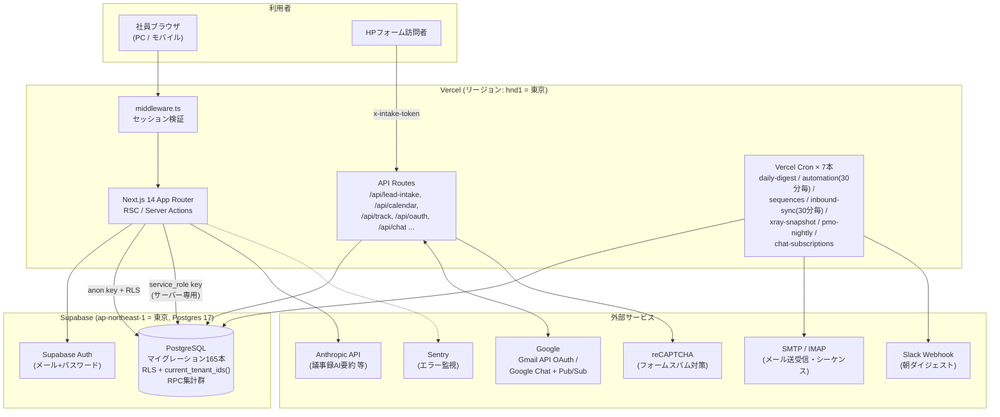
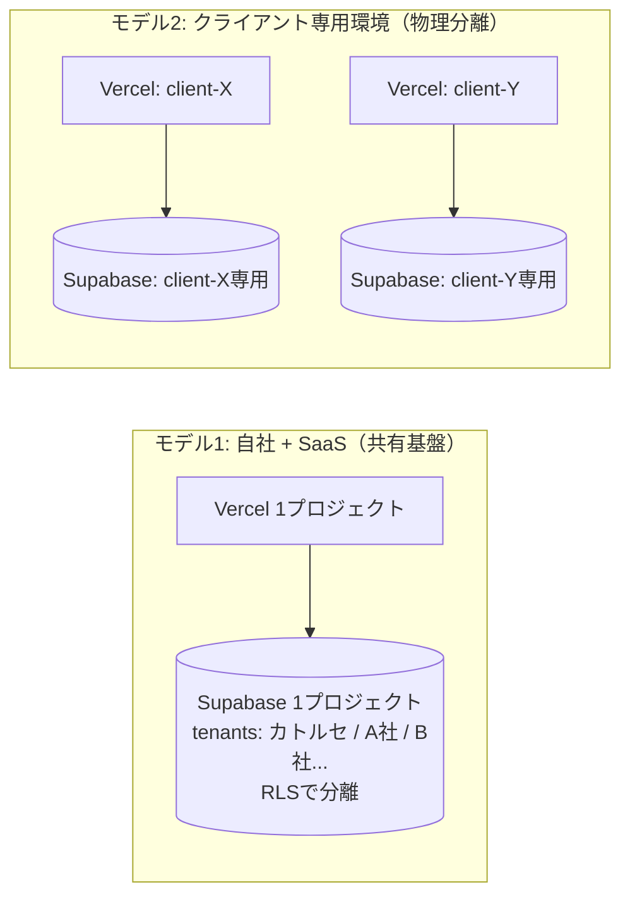
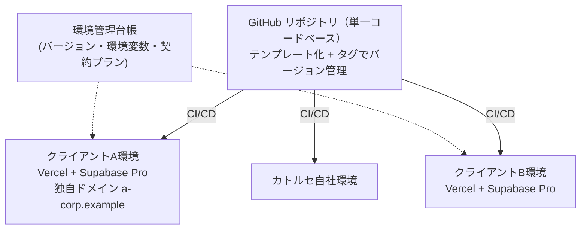
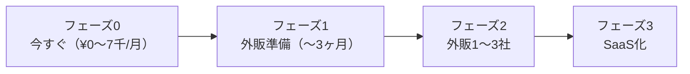

# インフラ構成分析 — Vercel + Supabase の可視化・リスク・クラウド比較・用途別アーキテクチャ（2026-07-24）

> **目的**: 現行の Vercel + Supabase 構成を可視化し、リスクを洗い出したうえで、AWS / Azure / Cloudflare と比較する。
> さらに今後のビジネス展開（①自社運用の拡張 ②クライアント専用環境の外販 ③SaaS提供）ごとに最適なアーキテクチャと、拡張時に必要になる打ち手を整理する。
> **関連文書**: `docs/INFRA_PROPOSAL_2026-07.md`（プラン別コスト提案）/ `docs/ARCHITECTURE_baseline_pre-renewal.md`（アプリ設計）/ `docs/AUDIT_2026-07-12_security_performance.md`
> 為替は概算 $1=¥155。価格は2026年7月時点の公表値ベースの概算で、**契約前に公式ページで要確認**。

---

## 0. エグゼクティブサマリー（3分で読む結論）

| 問い | 結論 |
|---|---|
| 今の構成は妥当か？ | **現フェーズ（自社数名〜十数名の利用）には最適解**。開発速度・運用負荷・コストの3点で AWS/Azure を選ぶ理由はまだない |
| 最大のリスクは？ | ①**プラン起因の性能・可用性**（2026-07-12のDB CPU飽和障害の主因。Free/Hobbyのままなら再発リスク残存）②**本番環境しかない**（検証が本番直撃）③**バックアップが弱い**（PITRなし＝誤操作・事故時に戻せない） |
| AWS/Azureに移るべきか？ | **今は不要**。移行が正当化されるのは「クライアントから閉域網・オンプレ・国内データ主権などの要件が出た時」「月額インフラ費が20万円を超えて割高になった時」 |
| Cloudflareは？ | Vercelの**代替候補としては有望**（特に外販でコスト構造を薄くしたい時）。ただしNext.jsの動作互換に検証コストがあり、**今すぐ乗り換える利点は小さい** |
| 外販・SaaSはこの構成でできるか？ | **できる**。アプリは既にマルチテナント設計（tenants + RLS）。①クライアント専用環境＝「プロジェクト分離」②SaaS＝「RLS共有」の**2モデルを使い分ける**のが本書の中心提案 |
| 今すぐやるべきことは？ | **(1)** Supabase Pro + Vercel Pro 化（規約・性能・自動停止の3リスク解消）**(2)** ステージング分離 **(3)** CRON_SECRET 等の未設定シークレット設定 **(4)** 「環境を量産できる仕組み」（環境構築のコード化）への着手 |

---

## 1. 現状構成の可視化

### 1.1 全体アーキテクチャ図

### 1.2 構成要素の棚卸し

| 層 | 内容 | 現状の事実 |
|---|---|---|
| ホスティング | Vercel（Next.js 14.2 / App Router） | リージョン `hnd1`（東京）固定。Hobbyプラン（2026-07-12時点の記録。**商用利用はPro以上が規約要件**） |
| DB/認証 | Supabase プロジェクト `catorce-sales-os` | **ap-northeast-1（東京）・Postgres 17・稼働正常**（2026-07-24 APIで確認）。マイグレーション165本を適用済み |
| 認可 | Postgres RLS | `current_tenant_ids()`（memberships参照）による**テナント分離が全テーブルに適用済み** — マルチテナントの土台は完成している |
| バッチ | Vercel Cron 7本 | 30分毎×2（automation / inbound-sync）、日次×4、6時間毎×1。`CRON_SECRET` は**任意設定のまま** |
| メール | Gmail API (OAuth) / SMTP / IMAP | 送受信・開封トラッキング・シーケンス。資格情報は `MAIL_CRED_SECRET` で暗号化してDB保存 |
| AI | Anthropic API | 議事録要約・コンテンツドラフト等（キー未設定なら無効化される設計） |
| 監視 | Sentry（DSN設定時のみ）＋ Supabaseログ | 外形監視なし。**障害検知はユーザー申告が起点になりがち** |
| 環境 | **本番のみ** | ステージング・検証環境なし。ローカル開発 → 本番直行 |
| IaC | なし | Vercel/Supabase の設定はダッシュボード手作業。**環境の再現手順がコード化されていない**（DEPLOY.mdに手順書はあり） |

### 1.3 データフローの要点

- **画面アクセス**: ブラウザ → Vercel Edge（middleware でCookieセッション検証）→ RSC/Server Actions → Supabase（anonキー+RLS、または管理操作のみ service_role）
- **リード流入**: HPフォーム → `/api/lead-intake`（`LEAD_INTAKE_SECRET` トークン + reCAPTCHA）→ DB → 自動返信メール + 社内通知
- **バッチ**: Vercel Cron → `/api/cron/*` → DB集計・メール同期・自動化ルール実行 → Slack/メール通知
- 東京リージョン同士（hnd1 ⇔ ap-northeast-1）なので**アプリ⇔DB間レイテンシは数ms**。この点は適切に設計されている

---

## 2. リスクの洗い出し

深刻度: 🔴 高（事業影響が直接的） / 🟡 中（条件次第で顕在化） / 🟢 低（把握しておけばよい）

### 2.1 プラン・契約リスク

| # | リスク | 深刻度 | 内容と根拠 | 対策 |
|---|---|---|---|---|
| P1 | DB共有CPUによる全面障害 | 🔴 | **2026-07-12に実際に発生**（リード系クエリでFree tierのCPU飽和→全画面タイムアウト）。アプリ側対策（RLS initplan化）は完了したが、Freeのままなら別トリガで再発しうる | Supabase Pro（専有コンピュート）。月$25〜 |
| P2 | 7日間未アクセスでDB自動停止 | 🔴 | Free tierの仕様。長期休暇明けに「システムが落ちている」が起こりうる | 同上（Proで解消） |
| P3 | Vercel Hobbyでの商用利用 | 🔴 | **規約違反状態**。アカウント停止リスクは低確率だが影響甚大 | Vercel Pro（$20/席） |
| P4 | バックアップ・PITRなし | 🔴 | 誤削除・不正操作・マイグレーション事故時に**任意時点へ戻せない**。CRMデータは事業の中核資産 | Proで日次7日分。外販開始時にPITR（+$100/月） |

### 2.2 運用・環境リスク

| # | リスク | 深刻度 | 内容 | 対策 |
|---|---|---|---|---|
| O1 | 本番環境しかない | 🔴 | 検証操作・マイグレーションが本番に直撃（07-12障害も検証負荷が一因）。165本のマイグレーションを無停止で当て続ける運用は綱渡り | Supabaseブランチ環境 or 別プロジェクト + Vercelプレビューでステージング分離 |
| O2 | 環境構築が手作業 | 🟡 | ダッシュボード操作 + 手順書ベース。**今は困らないが、外販で環境を量産する瞬間に最大のボトルネック化** | 環境構築のコード化（§5.2参照）。外販前に必須 |
| O3 | 障害検知が受動的 | 🟡 | Sentry未設定なら無効。外形監視なし。「ユーザーが気づく→申告」が起点 | Sentry DSN設定 + UptimeRobot等の無料外形監視（コスト¥0） |
| O4 | Cron認可が未設定 | 🟡 | `CRON_SECRET` 任意のまま。URLを知られると外部から `/api/cron/*` を叩ける（データ破壊ではないが、メール送信・API課金の踏み台になりうる） | CRON_SECRET設定（コスト¥0） |
| O5 | 鍵の一極集中 | 🟡 | `service_role` キーと `MAIL_CRED_SECRET` が漏れると全データ・全メール資格情報にアクセス可能。ローテーション手順が未整備 | Vercelで"Sensitive"登録徹底・四半期ローテーション手順の文書化 |
| O6 | 単一リージョン | 🟢 | 東京リージョン障害でアプリ・DBとも停止。ただし現規模でマルチリージョンはオーバーエンジニアリング | 現状は許容。SLAを外販契約に書く時に再検討 |

### 2.3 DB内部の健全性（2026-07-24 Supabase Advisor実測値）

Supabase公式のアドバイザリAPIを本日実行した結果:

| 種別 | 件数 | 内訳と評価 |
|---|---|---|
| セキュリティ | **71件（ERROR 0件）** | ・SECURITY DEFINER関数がauthenticated実行可能: 59件 / anon実行可能: 7件（**意図的なRPC設計だが、anon実行可の7件は要棚卸し**） ・漏洩パスワード保護が無効: 1件（Auth設定でONにするだけ） ・public スキーマ内の拡張: 1件 / search_path可変関数: 1件 / RLS有効だがポリシーなし: 2件 |
| パフォーマンス | **390件** | ・外部キー未インデックス: 205件（データ増で徐々に効く） ・重複permissiveポリシー: 125件（クエリ毎に複数ポリシー評価＝RLSオーバーヘッド） ・RLS initplan未対応の残り: 25件（07-12障害の同型。主要テーブルは対応済みで残りは低トラフィック表） ・未使用インデックス: 35件 |

> **評価**: 致命傷（ERROR）はゼロ。ただし「重複ポリシー125件 + initplan残25件」は**データ量が10倍になった時に07-12障害を再演するリスクの芽**であり、外販・SaaS前の計画的な解消を推奨（`INFRA_PROPOSAL_2026-07.md` §2 の残弾リストと同源）。

### 2.4 プラットフォーム依存（ロックイン）リスク

| 依存点 | 実態 | 脱出コスト |
|---|---|---|
| PostgreSQL本体 | 標準SQL + RLS。**Supabase固有機能への依存は薄い** | 低。`pg_dump` でRDS/Cloud SQL等へ移行可能（RLSもPostgres標準機能なのでそのまま動く） |
| Supabase Auth | `@supabase/ssr` でCookie連携。auth.usersテーブル前提のトリガあり | 中。Auth0/Cognito等への移行はセッション層の書き直しが必要 |
| Vercel Cron / API Routes | 標準的なNext.js API RoutesなのでHTTPトリガは可搬 | 低〜中。Cron定義の載せ替え（EventBridge / Cloudflare Cron等）は容易 |
| Next.js (App Router/RSC) | Vercel最適化前提の機能を多用 | 中。セルフホスト（Node/コンテナ）は可能だがISR/画像最適化等の性能特性が変わる |

**総評**: データ層（最重要資産）のロックインは意図的に低く保たれており、健全。最も移行コストが高いのはAuth。

---

## 3. AWS / Azure との比較

### 3.1 比較表

Vercel+Supabaseを「マネージドPaaSスタック」、AWS/Azureを「同等構成を自前で組む場合」（例: AWS = Amplify/ECS + RDS + Cognito + EventBridge、Azure = App Service + Azure Database for PostgreSQL + Entra ID + Functions）として比較。

| 観点 | Vercel + Supabase | AWS | Azure |
|---|---|---|---|
| 初期構築速度 | ◎ 数時間（実績あり） | △ 数週間（VPC/IAM/CI/CD設計から） | △ 数週間（同左） |
| 運用負荷 | ◎ ほぼゼロ（パッチ・スケール自動） | △ 専任知識が必要（IAM・パッチ・監視設計） | △ 同左 |
| 月額コスト（現規模） | ◎ ¥0〜1.5万 | ✗ 最低でも¥3〜8万（RDS+NAT+ALBだけで） | ✗ 同水準 |
| 月額コスト（大規模時） | △ 帯域・関数課金が逓増し割高化 | ◎ リザーブド等で単価最適化可能 | ◎ 同左 |
| 性能の上限 | △ DBは単一インスタンス+リードレプリカまで | ◎ Aurora等でほぼ無限 | ◎ 同等 |
| エンタープライズ要件 (閉域網・専用線・監査) | ✗ VPC接続不可・IP固定不可 | ◎ PrivateLink/VPN/詳細監査 | ◎ ExpressRoute/Private Endpoint |
| 日本の商習慣適合 (請求書払い・国内サポート) | △ クレカ払いのみ・英語サポート | ○ 請求書払い・日本語サポートあり | ◎ 官公庁・大企業に強い |
| コンプライアンス認証 | ○ SOC2 Type2 / HIPAA(Supabase) | ◎ ISMAP含むフル認証 | ◎ 同左（ISMAP・国内DC） |
| 人材確保 | ○ Next.js/Postgres人材は多い | ○ AWS人材は最多だが単価高 | △ Azure専門人材は相対的に少 |
| データ主権 | ○ 東京リージョン選択済み（AWS上で稼働） | ◎ 完全制御 | ◎ 完全制御 |

### 3.2 結論 — 「いつAWS/Azureに行くべきか」の判断基準

**今は行かない。** 現規模でAWS/Azureへ移ると「月額コスト3〜5倍・運用工数の発生・開発速度の低下」を対価に、まだ使わない拡張性を買うことになる。

移行を検討すべき**具体的トリガ**:

1. **クライアント要件**: 外販先から「閉域網接続」「オンプレDB連携」「ISMAP準拠」「請求書払いでのインフラ込み契約」を求められた時 → **その案件だけ**AWS構成を作る（全体移行ではない）
2. **コスト逆転**: Vercel+Supabaseの合計月額が**¥20万を超えた**時（この水準ならAWS predictable pricingが安くなり始める）
3. **性能上限**: 単一Postgresインスタンス（最大構成）+リードレプリカで捌けないワークロードが見えた時
4. **Azure特有**: クライアントがMicrosoft 365/Entra ID中心の企業で、テナント統合SSOが商談の決め手になる時（※後述の通りSupabase AuthでもSAML/Entra連携は可能なので、まず既存構成での実現を検討）

なお、**Supabase自体がAWS東京リージョン上で動いている**ため、「データはAWSに置きたい」という要望には現構成のままでも一定の説明が可能。

---

## 4. Cloudflare との比較

CloudflareはAWS/Azureとは性格が異なり、**「Vercelの代替」**として比較するのが正しい（DB層はSupabase継続が前提。Cloudflare D1はSQLiteベースでこの規模のリレーショナルワークロードには不適合）。

| 観点 | Vercel | Cloudflare (Workers / Pages) |
|---|---|---|
| Next.js互換性 | ◎ 開発元。全機能ネイティブ動作 | △ `@opennextjs/cloudflare` 経由。主要機能は動くが、**バージョン追従遅延・edge runtime制約・一部機能の非互換**の検証コストが常に発生 |
| 実行モデル | サーバーレス関数（リージョン指定可 = hnd1） | 全世界エッジ実行（リージョン概念が薄い） |
| **DB接続との相性** | ◎ hnd1⇔東京Supabaseで数ms | △ エッジ実行だと**DBから遠いPoPで実行されるとレイテンシ増**。Hyperdrive(接続プール)で緩和可能だが設計が一段複雑 |
| 料金構造 | 席課金($20/席) + 従量。**帯域・関数課金が規模で逓増** | ◎ Workers Paid $5/月〜で**帯域課金が実質なし**。大規模時に圧倒的に安い |
| Cron/キュー | Cron Jobs（本数制限あり） | ◎ Cron Triggers + Queues + Durable Objects（バッチ基盤としてはむしろ強力） |
| DDoS/WAF | 上位プランで提供 | ◎ 無料で世界最強クラスが標準付帯 |
| 運用実績(自社) | ◎ 稼働中 | ✗ ゼロから検証 |

### 結論

- **現時点で乗り換える理由はない**。Next.js 14 App Router + Server Actions を多用する本アプリでは、Vercelの互換性・安定性の価値が大きい
- ただし**外販・SaaSでコスト構造を薄くしたい局面**（例: クライアント環境を50面並べる、無料トライアルを大量提供する）では、Cloudflareの「帯域無料・低固定費」が効く。**将来の選択肢として温存**し、乗り換え判断時のPoC対象とする
- 今すぐ取れるいいとこ取り: **CloudflareをDNS/CDN/WAFとしてVercelの前段に置く**構成は低リスクで、独自ドメイン運用・DDoS対策・外販時のドメイン分離に有効

---

## 5. 用途別アーキテクチャ分析（自社 / クライアント専用環境 / SaaS）

### 5.0 大前提 — 既にある武器

本アプリのDBは初期設計から `tenants` + `memberships` + RLS（`current_tenant_ids()`）による**マルチテナント構造**になっており、全165マイグレーションがテナント分離を維持している。つまり:

- **1つのDBに複数社を同居させる（SaaS型）** … アプリ改修ほぼ不要で技術的には今すぐ可能
- **1社に1環境を丸ごと渡す（専用環境型）** … 同じコードをそのままデプロイすればよい

という**2つの提供形態を同一コードベースで両立できる**。これが最大の資産であり、以下の戦略はすべてこの上に立つ。

### 5.1 用途① 自社運用（現在〜拡張）

**現状評価**: 構成は適切。課題はプラン（§2.1）と環境分離（O1）のみ。

| 項目 | 推奨 |
|---|---|
| 構成 | 現行維持（Vercel hnd1 + Supabase東京） |
| プラン | Supabase Pro + Vercel Pro（月約¥7,000）を**即時**。常用負荷が上がったらコンピュートをSmall/Mediumへ（`INFRA_PROPOSAL` プランB） |
| 環境 | **本番/ステージングの2面化**。Supabaseブランチ環境（Pro付帯）+ Vercelプレビュー環境の接続で追加費ほぼゼロ |
| 運用 | Sentry有効化・外形監視・CRON_SECRET設定（すべて¥0）。マイグレーションは「ステージング検証→本番昇格」の2段階へ |
| 社内拡張時 | ユーザー数が数十名になってもこの構成のまま耐える（RLS initplan化済みの主要クエリはミリ秒台）。§2.3の重複ポリシー整理を計画的に消化 |

### 5.2 用途② クライアント専用環境（外販・環境分離型）

**「1クライアント = Vercel 1プロジェクト + Supabase 1プロジェクト」の物理分離モデル。**

**メリット**（このモデルが選ばれる理由）:
- データが物理的に完全分離 → セキュリティ審査・データ主権要求に最も通りやすい
- クライアント毎にバージョン固定・カスタマイズ・リージョン選択が可能
- 障害・負荷が他クライアントに波及しない
- 原価が明快（下表）なので**値付けしやすい**

**1環境あたりの原価目安**:

| 構成 | 月額原価 | 想定 |
|---|---|---|
| 最小（Supabase Pro Micro + Vercel既存チーム内） | 約 $25〜45 ≒ ¥4,000〜7,000 | 小規模クライアント |
| 標準（+コンピュートSmall + ステージング） | 約 $55〜75 ≒ ¥9,000〜12,000 | 通常 |
| 上位（+PITR + レプリカ） | 約 $180〜 ≒ ¥28,000〜 | データ保全SLA付き契約 |

**このモデルの成立条件 = 「環境の量産・保守をコード化すること」**。手作業のままだと3社目で破綻する。必要な整備（外販1社目までに着手）:

1. **プロビジョニング自動化**: Supabase CLI/Management API + Vercel APIで「新環境作成→165本マイグレーション適用→環境変数投入→シードデータ→動作確認」をスクリプト1本に
2. **マイグレーション配布の仕組み**: 全環境に同じマイグレーションを安全に配る CI（GitHub Actions で環境マトリクスに順次適用、ステージング→本番の昇格フロー）
3. **環境台帳**: どの環境がどのバージョン・どの契約プランかの管理（最初はスプレッドシートでも可、環境変数の暗号化保管とセット）
4. **バージョンポリシー**: 「全環境同一バージョン強制」か「クライアント毎に固定可」かを事前に決める（**強く前者を推奨**。後者はサポートコストが指数的に増える）
5. **監視の集約**: Sentryのプロジェクト分割 + 外形監視を環境追加時に自動登録

### 5.3 用途③ SaaS提供（マルチテナント共有型）

**「全顧客が1つのVercel+Supabaseに同居し、RLSで分離」するモデル。** 既存のtenants設計がそのまま本番になる。

**必要になる追加開発**（現状に無いもの）:

| 領域 | 内容 | 優先度 |
|---|---|---|
| セルフサインアップ | 申込→テナント作成→初期ユーザー招待の自動化（現在は手作業でメンバー発行） | 🔴 必須 |
| 課金 | Stripe等の従量/席課金、プラン制御（機能フラグ）、請求書発行 | 🔴 必須 |
| テナント管理画面 | カトルセ側のオペレーション用（テナント一覧・利用量・停止・なりすましログイン） | 🔴 必須 |
| 利用量ガードレール | テナント毎のレート制限・行数上限・重いRPCのクォータ（**ノイジーネイバー対策**。1社の暴走が全社を止める07-12型障害のSaaS版を防ぐ） | 🔴 必須 |
| オンボーディング | データインポート・初期設定ウィザード | 🟡 早期 |
| テナント毎の監査ログ・データエクスポート | 解約時の返却・コンプラ対応 | 🟡 早期 |

**インフラ面の勘所**:

- **コンピュートを先に太らせる**: 共有DBなので、テナント10社を超える前にMedium以上 + PITR + リードレプリカ（`INFRA_PROPOSAL` プランC、月¥3.5〜6万）へ。§2.3の重複ポリシー/未インデックスFKの解消は**SaaS開始前の必須工事**
- **バックアップの限界を契約で吸収**: 共有DBでは「1テナントだけ昨日時点に戻す」が困難（PITRはDB全体に効く）。テナント単位の日次論理エクスポート（pg_dump相当をテナントスコープで）を実装するか、SLAで復旧粒度を明記する
- **騒音隔離の逃げ道を残す**: 大口顧客は§5.2の専用環境へ「昇格」できる料金プランにしておく（同一コードベースなので移行はデータ移送のみ）

### 5.4 3モデルの使い分けマトリクス

| | 自社 | クライアント専用環境 | SaaS |
|---|---|---|---|
| 分離方式 | RLS（自社テナント） | **物理分離**（プロジェクト毎） | RLS（論理分離） |
| 1顧客あたり原価 | — | ¥4,000〜28,000/月 | ほぼゼロ（共有費を按分） |
| 値付けの目安 | — | 高単価・年契約（環境費+保守費を転嫁） | 低〜中単価・席課金 |
| セキュリティ審査耐性 | — | ◎ 最強 | ○（RLS+SOC2の説明で中堅企業までは通る） |
| 運用スケール限界 | — | 自動化なしで〜3社 / 自動化ありで〜数十社 | 数百テナントまで単一DBで可 |
| 先行投資 | プラン代のみ | プロビジョニング自動化（§5.2） | 課金・サインアップ・クォータ開発（§5.3） |
| 向く顧客 | — | 大手・セキュリティ要件が強い・カスタマイズ要求 | 中小・標準機能で足りる・数を取る |

**推奨戦略**: 外販初期は**専用環境型で高単価に売り**（自動化整備が進む）、標準化が固まった段階でSaaS型を下位プランとして追加する。両者は同一コードベースなので**開発は一本のまま**。

---

## 6. 将来の機能要件・顧客要望への対応マップ

外販・SaaS化で顧客から出がちな要望と、現構成での対応可否:

| 想定要望 | 現構成での答え | 追加コスト/工数 |
|---|---|---|
| SSO（Google Workspace / Microsoft Entra） | Supabase AuthがOAuth/SAML 2.0対応。**構成変更不要**（SAMLはPro以上） | 小 |
| 独自ドメイン | Vercelでドメイン追加のみ。専用環境なら環境毎に設定 | 小 |
| IPアドレス制限 | Vercel/Supabase単体では弱い。**Cloudflare(WAF)を前段に置く**か、middlewareでIP検査を実装 | 小〜中 |
| 監査ログ | `audit_logs` / `audit_events` テーブル実装済み。エクスポート機能の追加程度 | 小 |
| データの国内保管証明 | 東京リージョン（AWS ap-northeast-1上）で説明可能。SOC2レポートはSupabaseから取得可 | 小 |
| 任意時点復旧（RPO要件） | PITRアドオン（専用環境なら環境毎+$100/月） | 小（費用のみ） |
| 閉域網・専用線接続 | **不可能**。この要望が出た案件のみAWS個別構成（§3.2トリガ1） | 大 |
| 99.9%超のSLA契約 | Supabase/VercelのSLA（Pro/Enterprise）を下敷きに、自社SLAは控えめに設計。マルチリージョンは現実的でない | 中（契約設計） |
| モバイルアプリ | Supabaseはネイティブ SDKあり。API層はそのまま使える | 中（アプリ開発のみ） |
| AI機能の拡張（自動要約・スコアリング等） | Anthropic API従量を環境毎キーで分離すれば原価転嫁も容易 | 小〜中 |
| 大量データ分析（BI連携） | Supabaseはただの Postgres なので**読取専用ロールでBIツール直結可**。負荷分離はリードレプリカで | 小〜中 |

---

## 7. 推奨アクションプラン（時系列）

| フェーズ | やること | 費用感 |
|---|---|---|
| **0. 今すぐ** | ① Supabase Pro + Vercel Pro化（P1〜P4解消）② CRON_SECRET・Sentry・外形監視の設定 ③ 漏洩パスワード保護ON・anon実行可RPC 7件の棚卸し | 月約¥7,000 + 作業のみ |
| **1. 外販準備** | ① ステージング環境分離とマイグレーション2段階運用 ② プロビジョニング自動化スクリプト（§5.2-1,2）③ §2.3のDB健全化（重複ポリシー125件・initplan残25件・FKインデックス）④ 環境台帳・鍵ローテーション手順 | 月+¥5,000前後 + 開発工数 |
| **2. 外販1〜3社** | ① 専用環境モデルで提供開始（1社あたり原価¥4千〜2.8万/月を価格転嫁）② Cloudflareを前段DNS/WAFに導入 ③ 契約にSLA・復旧粒度を明記 | 顧客数比例（粗利設計可能） |
| **3. SaaS化** | ① 課金・セルフサインアップ・テナント管理・クォータ開発（§5.3）② 共有DBをプランC構成（PITR+レプリカ）へ ③ 大口の専用環境昇格プラン整備 | 月¥3.5〜6万 + 開発投資 |

**見直しトリガ（再掲・拡張）**: ①リード5万件 or 案件5千件 ②同時利用10名超 ③外販1社目の契約 ④閉域網等のエンタープライズ要件を持つ商談の発生 ⑤インフラ月額¥20万超え — いずれかで本書を再評価する。

---

*本書の数値のうち、Supabaseアドバイザリ件数・リージョン・DBバージョンは2026-07-24にAPIで実測。プラン・価格は公表値ベースの概算であり契約前に公式確認を要する。*
