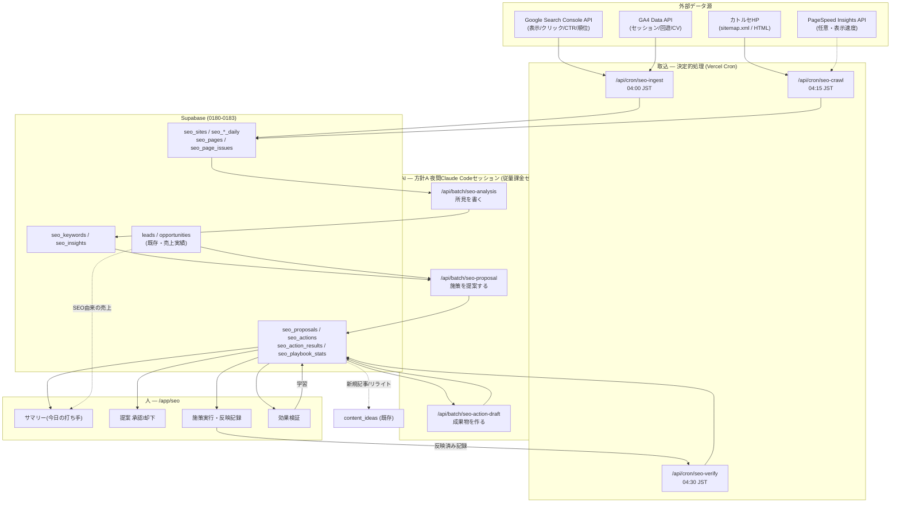

# SEOグロースエンジン 詳細設計（2026-07）

**目的**: カトルセHPのアクセス数 → 問合せ件数 → 成約数・売上 を増やす。
**手段**: **SEOコンサルタント（AIエージェント + 人）が毎日PDCAを回す**仕組みを CRM の中に作る。
**出口**: 発生した問合せは既存の `POST /api/lead-intake` を通って **CRMのリード**になり、商談・受注・売上まで一気通貫で追跡される。

**対象機能（本書のスコープ）**

| ID | 機能 | 一言でいうと |
|---|---|---|
| **F-301** | SEO分析機能 | GSC/GA4/クロール/CRM を毎日取り込み、「どこが伸びていて、どこで損しているか」を数値で確定させる（Plan の材料） |
| **F-302** | 改善提案機能 | 機会を検出し、**期待リード数・期待売上に換算した優先度付き提案**を毎朝出す（Plan の決定） |
| **F-303** | 施策実行機能 | 提案を「実行チケット」に落とし、成果物（記事・タイトル案・内部リンク指示書）まで作って実行・反映を管理する（Do） |
| **F-304** | 効果検証・学習 | 施策の前後を差分比較して勝ち負けを判定し、提案ロジックの重みに反映する（Check → Act） |
| **F-305** | 集客アトリビューション | 検索キーワード → 着地ページ → 問合せ → リード → 商談 → 受注金額 をつなぐ（目的の実証） |
| **F-306** | **SEO戦略ボード** | 集客戦略（目標逆算・3層・クラスタ・90日計画）の**進捗とズレを毎日1画面で確認**する。日次の提案はすべてこの戦略に紐づく |

**関連文書**: **`docs/SEO_STRATEGY_2026-07.md`（集客戦略の本体。F-306はこれを画面化したもの）** / `docs/HP_INQUIRY_FORM_INTEGRATION_2026-07.md`（問合せ→リード連携・本設計はこれを拡張）/ `docs/SALES_AUTOMATION_DESIGN_2026-07.md` §7（方針A・夜間バッチ）/ `docs/exec-plan/runbooks/NIGHTLY_BATCH.md`（夜間セッション runbook）/ `docs/LEAD_TO_APPOINTMENT_DESIGN_2026-07.md`（リード→アポ。SEOの下流）

---

## 実装状況（2026-07-29 時点）

| WO | 内容 | 状態 |
|---|---|---|
| **WO-30** | 計測基盤（migration 0180 / SA認証 / GSC・GA4クライアント / 取込cron / サマリー・接続設定画面） | **実装済み・本番マイグレーション適用済み**。稼働はサービスアカウントの権限付与待ち（ジョブは `enabled=false`） |
| WO-31〜36 | アトリビューション / 戦略ボード / 分析 / 提案 / 実行 / 検証 | 未着手 |

**本番DB実査で判明した前提（2026-07-29・§9.4に詳細）**
- 成約率 **48.5%**（受注245 / 失注260）、カトルセ本体の受注単価 **中央値 ¥1,800,000**
- 商談の流入元は展示会が52%。**SEO・LP・HP問合せ由来の商談は0件**（新規チャネルの立ち上げ）
- **リード→商談の紐付け（`lead_id`）が全商談の2%**しかない ← WO-31 の最重要課題

---

## 0. 先に結論

1. **「SEOツール」を作るのではなく、「毎日PDCAが回る業務ループ」を作る。** 画面は分析ダッシュボードではなく、**朝に見て、今日やることが決まり、夜に成果物ができている**導線として設計する。
2. **データは決定的処理で毎晩取り込み、AIは"解釈と文章生成"だけを担当する。** 数値の集計・順位・比較は SQL/TS で確定させ（再現性・監査性）、AIは所見と提案文と成果物（記事・タイトル案）を書く。**Vercel Cron（決定的処理）+ 夜間 Claude Code セッション（方針A・従量課金ゼロ）** の二段構成で、既存の `batch_job_settings` / `batch_runs` / AI確認キューにそのまま乗せる。
3. **提案は必ず「期待リード数」「期待売上」に換算する。** SEO施策の優先度を CTR や順位ではなく **CRMの実績CVR・成約率・平均受注単価** で金額化する。これがこの設計の中核であり、既存のSEOツールにはない CRM 一体型の強み。
4. **AIは提案・成果物までを作り、公開は必ず人が承認する（v1）。** HP本体への自動デプロイはしない。実行モードは「アプリ内で完結」「記事パイプライン（`content_ideas`）へ連携」「HP保守担当への指示書を発行」の3系統。
5. **効果検証は前後比較ではなく差分比較（DiD）**。対象ページの前後変化から**サイト全体の同期間変化を引く**ことで、季節変動・アルゴリズム変動を除去して勝敗を判定する。
6. **日次の改善を、戦略に紐づけて管理する。** 期待売上だけで並べると短期に効くCTR改善ばかりが上位を占め、3ヶ月後に効くクラスタ構築が永久に後回しになる。**戦略ボード（F-306）**で目標逆算・トピッククラスタ・検索意図3層・90日計画の進捗を毎日可視化し、提案のスコアに戦略係数を掛けて近視眼を補正する。戦略の中身は `docs/SEO_STRATEGY_2026-07.md`。
7. 追加テーブルは **migration 0180〜0184**、新規画面は **`/app/seo` 配下8画面**、新規cron **3本**、新規バッチAPI **3本**。既存機能の破壊的変更は `leads` への列追加と `/api/lead-intake` の**後方互換な**フィールド追加のみ。

---

## 1. 目的の定義 — KPIツリー

「アクセス数 → 問合せ → 成約・売上」を1本の式に落とす。**各段の数値をすべて本機能で計測する**（右列が取得元）。

```
売上(SEO由来)
 └ 受注件数        = 商談数 × 成約率                     ← CRM: opportunities(受注/失注)
    └ 商談数       = リード数 × 商談化率                  ← CRM: leads → opportunities
       └ リード数  = 問合せ数 (- 対象外/スパム)           ← CRM: leads(/api/lead-intake)
          └ 問合せ数 = セッション数 × CVR                 ← GA4 + CRM実績
             └ セッション数 = クリック数 × (1 - 直帰的離脱) ← GA4
                └ クリック数 = 表示回数 × CTR             ← Google Search Console
                   └ 表示回数 = 対象KW数 × 検索需要 × 掲載順位 ← Google Search Console
```

### 1.1 本機能が動かすレバー（=施策タイプの根拠）

| レバー | 効く段 | 代表施策 | 効果が出るまで |
|---|---|---|---|
| 掲載順位 | 表示回数 | リライト・内部リンク強化・新規記事・E-E-A-T強化 | 2週間〜3ヶ月 |
| CTR | クリック | タイトル/メタディスクリプション改善・構造化データ | **3〜14日（最速）** |
| 回遊・滞在 | セッション→CVR | 関連記事導線・目次・表示速度 | 2〜4週間 |
| CVR | 問合せ | CTA配置・フォーム項目削減・資料DL導線・LP改善 | **即日〜2週間** |
| リード質 | 商談化率 | 検索意図と提供コンテンツの一致（商用意図KWの獲得） | 1〜3ヶ月 |

> **設計上の含意**: 「順位を上げる」だけが SEO ではない。**CTRとCVRは最速で売上に効く**ので、提案エンジンは順位改善と同列にこの2つを扱う（§6.2 の期待値計算で自動的に優先度が付く）。

### 1.2 初期ベースライン（本機能の最初の仕事）

数値は未取得のため、**導入初週のタスクとして `docs/exec-plan/BASELINE_NUMBERS.md` に SEO 節を追記**する。取得項目:
表示回数/クリック/CTR/平均順位（サイト全体・上位50KW）、セッション、問合せ数、リード→商談化率、成約率、平均受注単価、公開ページ数。
**これがないと §6.2 の期待売上換算が動かない**ため、F-301 の受入基準に含める。

---

## 2. to-be 運用フロー — 「毎日PDCAが回る」の実体

**登場人物**: ①夜間バッチ（決定的処理）②夜間 SEOコンサルタント AI（Claude Code セッション）③人（マーケ担当 / 代表）④HP保守担当（社内 or 制作会社）

```
04:00 JST  [Cron] seo-ingest   GSC/GA4を取り込み・クロール差分・CRM実績と突合
                                → 指標確定(seo_*_daily / seo_pages)
04:30 JST  [Cron] seo-verify   期限が来た施策の効果を差分比較で判定 → win/flat/loss
05:00 JST  [AI]  seo_analysis  確定した数値から「所見」を書く（劣化/機会/カニバリ/欠陥）
05:20 JST  [AI]  seo_proposal  所見 → 施策提案（仮説・根拠・期待リード数・ICE）
05:40 JST  [AI]  seo_action_draft 承認済み施策の成果物を作る（記事/タイトル案/指示書）
─────────────────────────────────────────────────────────────
09:00      [人]  /app/seo を開く（3分）
                 ・昨日の結果と効果検証（勝った/負けた）
                 ・今日の提案 上位3件を「承認 / 却下 / 保留」
                 ・承認 = 実行チケット化（担当・期限・実行モードが自動で入る）
                 ・AI生成済みの成果物をレビュー → 反映指示（アプリ内 or HP側へ）
随時       [人/HP] 施策を反映 → 「反映済み」を記録（= 効果検証の起点マーカー）
14日後     [Cron] 自動で効果判定 → 勝ちパターンは提案の重みに加算（学習）
```

**1日の人の所要時間 = 目標15分**（承認3分 + 成果物レビュー10分 + 反映依頼2分）。これを満たせない設計は却下する、を設計原則にする。

**週次**: `/app/reviews/weekly`（既存）に「SEO今週のサマリー」を1枚追加。月次: 経営レビュー（`/app/exec`）に **SEO由来の売上・ROI** を1枚追加。

---

## 3. 前提 — 接続できる既存資産（実査 2026-07-29）

新規に作らず、必ず既存に接続する。

| 資産 | 実体 | 本機能での使い方 |
|---|---|---|
| 問合せ受付 | `POST /api/lead-intake`（`media`/`source`/`tags`/ハニーポット/自動返信） | **出口**。ここに `landing_page`/`utm_*`/`referrer` を後方互換で追加し、SEO起点を特定（F-305） |
| リード | `leads`（`inquiry_media`, `inquiry_tags`, `raw_event`, `marketing_channel_id`, `funnel_stage`） | 問合せ→リード→商談の実績。**期待値換算の分母**（§6.2） |
| 記事パイプライン | `content_ideas`（idea→selected→drafting→published, `target_keyword`, `body_md`, `design_status`） | **施策タイプ「新規記事」「リライト」の実行先**。SEO提案から自動起票 |
| 夜間AI基盤 | 方針A（Claude Code セッション） + `/api/batch/*` ingest API + `CRON_SECRET` | AI所見・提案・成果物生成の実行方式。**従量課金ゼロ**を維持 |
| ジョブ制御 | `batch_job_settings`(job_kind別 enabled) / `batch_runs`(実行ログ) / `/app/exec/batch` | SEOジョブ3種を同じ枠組みで on/off・監視 |
| 人の確認 | AI確認キュー `/app/review`（`getReviewQueue`） | **AI生成の提案・成果物は必ずここを通す**（承認なしで外に出さない） |
| 通知 | アプリ内通知 + Slack Webhook + Google Chat | 「緊急の劣化検知」「勝ち施策の報告」 |
| 施策ROI基盤 | `marketing_channels` / `channel_costs` / チャネル別ROI RPC | SEOを1チャネルとして既存ROI比較に載せる（展示会・広告と横並び比較） |
| ワークフロー | `automation_rules`（`/api/cron/automation`） | 「SEO由来リードは即通知」等のトリガー追加 |
| Google連携 | `src/lib/google-oauth.ts`（fetch直叩き・SDK不使用） | GSC/GA4接続の実装様式を踏襲（§5.1） |

> **重要な前提**: 本設計は **HP本体のコードには一切触れない**。HP側に求めるのは ①フォーム送信時の追加フィールド（§9.1）②施策の反映作業 のみ。HPがWordPressでも静的でも成立する。

---

## 4. アーキテクチャ全体像



**レイヤー責務の原則**

| レイヤー | やること | やらないこと |
|---|---|---|
| 取込(Cron) | API取得・正規化・保存・ロールアップ・**すべての数値計算** | 解釈・文章生成 |
| 分析(AI) | 数値に対する**所見**（なぜ・何が問題か）の言語化 | 数値の再計算（DBの値をそのまま引用させる） |
| 提案(AI) | 仮説・施策・根拠の文章化。ICE の主観値付け | 期待値の算術（アプリが計算した期待リード数を提示） |
| 実行(AI+人) | 成果物生成（記事・タイトル案・指示書） | **公開・デプロイ（必ず人）** |
| 検証(Cron) | 差分比較・勝敗判定・学習重み更新 | — |

> **なぜ数値をAIにやらせないか**: 毎日回すため再現性と監査性が要る。数値がブレると「先週の提案は何だったのか」が説明できず、PDCAが崩壊する。AIの役割は**判断材料の言語化と成果物生成**に限定する。

---

# F-301 SEO分析機能

## 5.1 データソースと接続方式

| # | ソース | 取得内容 | 頻度 | 接続方式 |
|---|---|---|---|---|
| A | Search Console API (`searchanalytics.query`) | 表示回数・クリック・CTR・平均順位（クエリ別/ページ別/デバイス別/日別） | 日次 | **サービスアカウント**（推奨） |
| B | GA4 Data API (`runReport`) | セッション・エンゲージメント率・平均エンゲージメント時間・イベント（問合せ送信） | 日次 | 同上 |
| C | 自前クロール | title/meta description/h1/canonical/noindex/文字数/内部リンク/発リンク/HTTPステータス | 日次200URL上限 | `fetch` + 正規表現抽出（依存追加なし） |
| D | PageSpeed Insights API | LCP/INP/CLS（フィールド値優先） | 週次・主要20URL | 任意（`PSI_API_KEY`） |
| E | CRM（自社DB） | 問合せ→リード→商談→受注金額 | 日次 | 内部クエリ |

### 認証方式の決定：サービスアカウント（推奨）

既存の `google-oauth.ts` は**ユーザー個人**のトークンを持つ設計だが、SEOデータは**テナント資産**であり、担当者の退職・再認証で欠測してはいけない。よって GSC/GA4 は**サービスアカウント + JWT Bearer グラント**で接続する。

```
1. GCPでサービスアカウントを1つ作成（鍵JSONを発行）
2. Search Console → 設定 → ユーザーと権限 → SAのメールを「制限付き」で追加
3. GA4 → 管理 → プロパティのアクセス管理 → SAのメールを「閲覧者」で追加
4. 環境変数: GOOGLE_SEO_SA_EMAIL / GOOGLE_SEO_SA_PRIVATE_KEY / (GSC_PROPERTY / GA4_PROPERTY_ID はDB管理)
```

実装は既存様式に合わせ **googleapis SDK を使わず** `crypto.createSign('RSA-SHA256')` で JWT を自己署名し、`https://oauth2.googleapis.com/token` に `grant_type=urn:ietf:params:oauth:grant-type:jwt-bearer` で交換する（新規依存ゼロ）。想定モジュール: `src/lib/seo/google-sa.ts`。

> **フォールバック**: 組織方針でSAを追加できない場合のみ、既存 `google-oauth.ts` に `webmasters.readonly` / `analytics.readonly` スコープを足し、**代表アカウントで1回接続 → refresh_token を暗号化保存**（`crypto-mail.ts` を流用）。運用上の脆さ（再認証必要）は `/app/seo/settings` に接続状態バッジで可視化する。

### GSC取得の実務仕様（落とし穴対策）

- **データ遅延**: GSCは概ね2〜3日遅れ。取込は `D-3` を主対象とし、**`D-3`〜`D-16` を毎日 upsert し直す**（後日確定分の取りこぼし防止）。
- **行数制限**: 1リクエスト最大25,000行。**保存はページ別Top300/日・クエリ別Top500/日・(ページ×クエリ)Top500/日**に制限（§12 データ量）。
- **プライバシーしきい値**: 検索ボリュームが小さいクエリはGSCが返さない。これを「消えた」と誤検知しないよう、**表示回数が閾値未満のクエリは劣化検知の対象外**にする（`MIN_IMPRESSIONS = 30`）。
- **平均順位の扱い**: GSCの position は「表示された中での平均」。順位改善の判定は必ず**表示回数を重み**に使う。

## 5.2 データモデル（migration 0180_seo_foundation.sql）

> **実装時の設計変更（2026-07-29）**: 対象サイトが「catorce.jp」「catorce.jp/career/」「（将来）aicafe.jp」と確定したため、
> **接続単位（ドメイン）と計測単位（サイト）を分離**した。catorce.jp と /career/ は同一ドメインであり、
> GSCプロパティは1本（`sc-domain:catorce.jp`）で両方をカバーする。一方で /career/ はフリーランスエンジニア個人向け（B2C）で、
> 法人向け本体（B2B）とは検索意図もKPIも別物のため、**同じ数字に混ぜてはいけない**。
> よって `seo_properties`（GSC/GA4の接続）と `seo_sites`（path_prefix / exclude_prefixes による計測単位）の2階層にした。
> 振り分けロジックは `src/lib/seo/site-match.ts`（純関数・テスト済み）。

```sql
-- 対象サイト（カトルセHP / キャリプラ / Aicafe … 複数サイト対応）
create table if not exists public.seo_sites (
  id uuid primary key default gen_random_uuid(),
  tenant_id uuid not null references tenants(id) on delete cascade,
  name text not null,                       -- 'カトルセHP'
  base_url text not null,                   -- 'https://www.catorce.jp'
  gsc_property text,                        -- 'sc-domain:catorce.jp' or URLプレフィックス
  ga4_property_id text,                     -- '123456789'
  sitemap_url text,
  inquiry_media text,                       -- leads.inquiry_media との突合キー（'カトルセHP'）
  marketing_channel_id uuid references marketing_channels(id) on delete set null,
  crawl_enabled boolean not null default true,
  crawl_limit int not null default 200,
  is_primary boolean not null default false,
  status text not null default 'active',
  notes text,
  created_at timestamptz not null default now(),
  updated_at timestamptz not null default now()
);

-- サイト全体の日次（GSC + GA4 + CRMを1行に統合＝KPIツリーの各段）
create table if not exists public.seo_daily_metrics (
  id uuid primary key default gen_random_uuid(),
  tenant_id uuid not null references tenants(id) on delete cascade,
  site_id uuid not null references seo_sites(id) on delete cascade,
  date date not null,
  impressions bigint default 0, clicks bigint default 0,
  ctr numeric, position numeric,            -- 表示回数を重みにした加重平均
  sessions bigint default 0, organic_sessions bigint default 0,
  engaged_sessions bigint default 0, avg_engagement_sec numeric,
  inquiries int default 0,                  -- CRM: leads の当日新規（当該メディア）
  leads_valid int default 0,                -- 対象外/スパムを除いた有効リード
  created_at timestamptz not null default now(),
  unique (site_id, date)
);

-- ページ別日次（Top300/日）
create table if not exists public.seo_page_daily (
  id uuid primary key default gen_random_uuid(),
  tenant_id uuid not null, site_id uuid not null references seo_sites(id) on delete cascade,
  date date not null, page_path text not null,
  impressions bigint default 0, clicks bigint default 0, ctr numeric, position numeric,
  sessions bigint default 0, engagement_rate numeric,
  unique (site_id, date, page_path)
);

-- クエリ別日次（Top500/日）。page_path付きは (ページ×クエリ) の主要行のみ
create table if not exists public.seo_query_daily (
  id uuid primary key default gen_random_uuid(),
  tenant_id uuid not null, site_id uuid not null references seo_sites(id) on delete cascade,
  date date not null, query text not null, page_path text,
  impressions bigint default 0, clicks bigint default 0, ctr numeric, position numeric,
  device text,
  unique (site_id, date, query, page_path, device)
);

-- 週次ロールアップ（保持ポリシー用・分析はこちらを主に読む / §12）
create table if not exists public.seo_page_weekly  ( ... week_start date, 同上指標, prev_position numeric );
create table if not exists public.seo_query_weekly ( ... week_start date, 同上指標, prev_position numeric );

-- ページの現況スナップショット（クロール結果・1URL1行）
create table if not exists public.seo_pages (
  id uuid primary key default gen_random_uuid(),
  tenant_id uuid not null, site_id uuid not null references seo_sites(id) on delete cascade,
  url_path text not null,
  title text, meta_description text, h1 text,
  word_count int, status_code int, canonical text, noindex boolean default false,
  internal_inlinks int default 0,           -- サイト内から張られている本数
  internal_outlinks int default 0,
  published_at date, last_modified_at date, -- 記事の鮮度
  content_idea_id uuid references content_ideas(id) on delete set null, -- 記事パイプラインとの紐付け
  lcp_ms int, inp_ms int, cls numeric, psi_checked_at timestamptz,
  first_seen_at date, last_crawled_at timestamptz,
  created_at timestamptz not null default now(),
  updated_at timestamptz not null default now(),
  unique (site_id, url_path)
);

-- 機械的欠陥（クロールで確定できるもの＝AI不要）
create table if not exists public.seo_page_issues (
  id uuid primary key default gen_random_uuid(),
  tenant_id uuid not null, site_id uuid not null,
  page_id uuid not null references seo_pages(id) on delete cascade,
  kind text not null,      -- 'title_missing'|'title_too_long'|'meta_missing'|'h1_multiple'
                           -- |'thin_content'|'broken_link'|'noindex_unexpected'|'orphan_page'
                           -- |'duplicate_title'|'slow_lcp'|'no_internal_link'
  severity text not null default 'medium',  -- 'high'|'medium'|'low'
  detail jsonb not null default '{}'::jsonb,
  status text not null default 'open',      -- 'open'|'fixed'|'ignored'
  first_detected_at timestamptz not null default now(),
  resolved_at timestamptz
);
```

RLSは既存踏襲: `select` = `tenant_id in (select current_tenant_ids())`、`insert/update/delete` = `can_edit_role(tenant_id)`。書き込みは基本 service role（cron/batch）。

## 5.3 分析ロジック（すべて決定的処理・`src/lib/seo/analyze.ts`）

AIに渡す前に、アプリが以下を機械的に確定させる。**これが「毎日同じ基準で見る」の実体**。

| # | 検出名 | 条件（初期値・`seo_settings` で調整可） | なぜ重要か |
|---|---|---|---|
| 1 | **CTR機会損失** | 掲載順位 ≤ 10 かつ 実CTR < 順位別ベンチマークCTR × 0.7 かつ 表示回数 ≥ 100/28日 | タイトル改善だけで**最速3日**でクリックが増える |
| 2 | **あと一歩KW（順位11-20）** | 平均順位 11〜20 かつ 表示回数 ≥ 50/28日 | 1ページ目入りの費用対効果が最大。リライト対象の一軍 |
| 3 | **順位劣化** | 直近7日の加重平均順位 が 前28日比で +3位以上悪化 かつ 表示回数 ≥ `MIN_IMPRESSIONS` | 放置すると既存流入が溶ける。**検知即通知** |
| 4 | **クリック急減** | 直近7日クリック が 前4週同曜日平均比 −30%以下（表示回数減を伴わない場合はCTR要因と自動判別） | 上と同じ。原因層（表示 or CTR）まで自動特定 |
| 5 | **カニバリゼーション** | 同一クエリで2URL以上が同期間に表示され、双方とも順位 ≤ 30 | 自社ページ同士が食い合い、どちらも上がらない典型 |
| 6 | **コンテンツギャップ** | ターゲットKW台帳(`seo_keywords`)に登録済みだが、対応ページが未存在 or 順位 > 30 | 新規記事の起票根拠 |
| 7 | **孤立ページ** | `internal_inlinks = 0` かつ 公開済み | 内部リンク1本で順位が動くことが多い最安施策 |
| 8 | **薄いコンテンツ** | `word_count < 800` かつ クリック < 5/28日 かつ 公開後90日超 | リライト or 統合の候補 |
| 9 | **鮮度劣化** | `last_modified_at` が18ヶ月以上前 かつ 過去にクリック実績あり かつ 直近クリック減 | 更新するだけで戻ることが多い |
| 10 | **CVR不良ページ** | セッション ≥ 100/28日 かつ 問合せ 0 かつ 商用意図KW流入 | **売上に最も近い損失**。CTA/フォロー導線の問題 |
| 11 | **高CVRページ**（＝勝ち筋） | 問合せ ≥ 1 かつ CVR がサイト平均の2倍以上 | **横展開の種**。同型記事の量産・内部リンク集中の根拠 |
| 12 | **機械的欠陥** | `seo_page_issues` の open 行 | 迷ったら潰す。低コスト・低リスク |

### 機会スコア（提案の並び順の一次ソート）

```
opportunity_score = 追加見込みクリック × 商用意図係数 × 実現容易性
  追加見込みクリック = 表示回数(28日) × (到達可能CTR - 実CTR)
     到達可能CTR = 目標順位のベンチマークCTR（順位1:28% / 2:15% / 3:11% / 4-5:8% / 6-10:3% / 11-20:1%）
  商用意図係数 = 1.5(「料金」「比較」「会社」「依頼」「相談」等) / 1.0(一般) / 0.6(情報収集のみ)
  実現容易性 = 1.2(タイトル/メタ) / 1.0(リライト) / 0.7(新規記事) / 0.5(サイト構造)
```

> 数式・ベンチマークCTRは `src/lib/seo/benchmark.ts` に定数として置き、**Vitestでユニットテストする**（既存 `tests/` 方針に従う）。実データが3ヶ月貯まったら自サイト実測CTRカーブに置換する（学習点その1）。

## 5.4 画面 `/app/seo`（サマリー）

「今日の打ち手が3分で決まる」ことだけを目的にレイアウトする。

```
┌ SEO集客 ─────────────────────────────────────────────┐
│ [今月] 表示 152,400 → クリック 6,120(CTR 4.0%) → セッション 5,890 │
│        → 問合せ 18件 → リード 14件 → 商談 6件 → 受注 2件 / ¥3,200,000 │
│        （前月比: 表示 +12% / 問合せ +5件 / 受注 +1件）              │
│  ※ KPIツリーを横1本のファネルで表示（各段クリックで内訳へ）           │
├───────────────────────────────────────────────────────┤
│ 🚨 今日の要対応(3)      │ 💡 今日の提案 上位3件            │
│ ・「生成AI 研修 費用」  │ 1. /blog/ai-training のタイトル改善 │
│   順位 8→14 に劣化      │    期待 +42クリック/月 → +1.3リード │
│ ・/contact のLCP 4.2s   │    [承認] [却下] [詳細]           │
│ ・孤立ページ 6件        │ 2. …                              │
├───────────────────────────────────────────────────────┤
│ 📈 効果検証（判定済み）  4勝 1分 1敗 / 累計 +680クリック/月     │
│ 🧾 実行中の施策(5)  反映待ち 2 / 執筆中 2 / 検証待ち 1          │
└───────────────────────────────────────────────────────┘
```

配下タブ: **キーワード** / **ページ** / **提案** / **施策** / **効果検証** / **設定**。
デザインは既存トークン準拠（Primary Teal `#008C8C` / Accent Orange `#F59A2A`、数字は大きく単位は小さく）。

---

# F-302 改善提案機能

## 6.1 生成パイプライン（ルールで絞り、AIが言語化する）

```
seo_insights（§5.3 の12検出・機械生成）
      │ ① 提案化フィルタ：opportunity_score 上位 / 重複除去 / クールダウン判定
      ▼
候補（1日最大10件）
      │ ② 夜間AIセッションが GET /api/batch/seo-proposal で受け取り、
      │    仮説・根拠・具体的な打ち手・想定リスクを日本語で書く
      ▼
seo_proposals（status='pending_review'）→ AI確認キュー & /app/seo/proposals
      │ ③ 人が 承認 / 却下 / 保留（却下理由は学習に使う）
      ▼
seo_actions（実行チケット）
```

**クールダウンと重複防止（毎日回すための必須ガード）**

- 同一 (対象URL × 施策タイプ) は、**前回実行から効果検証が終わるまで（既定14日）再提案しない**。
- 却下された提案は同一対象に対し**30日間**再提案しない（却下理由が `not_now` の場合は7日）。
- 1日の新規提案は**最大10件、承認可能な実行中施策は同時20件まで**（人が処理できる量を超えない）。

## 6.2 優先度 — 期待リード数・期待売上への換算（本機能の中核）

提案は必ず「**やると月いくら増えるか**」で並べる。分母はすべて**CRMの実績値**（推測しない）。

```ts
// src/lib/seo/expected-value.ts （純関数・テスト対象）
type Rates = {
  sessionPerClick: number;   // GA4セッション ÷ GSCクリック（直近90日実績・既定0.95）
  inquiryCvr: number;        // 問合せ数 ÷ セッション数（サイト実績。ページ単位があればそちらを優先）
  validRate: number;         // 有効リード ÷ 問合せ（スパム除外率・CRM実績）
  oppRate: number;           // 商談化 ÷ 有効リード（CRM実績）
  winRate: number;           // 受注 ÷ 商談（CRM実績）
  avgDealAmount: number;     // 平均受注金額（CRM実績）
};

expectedMonthlyClicks = 追加見込みクリック(§5.3)
expectedLeads   = expectedMonthlyClicks × sessionPerClick × inquiryCvr × validRate
expectedOpps    = expectedLeads × oppRate
expectedRevenue = expectedOpps × winRate × avgDealAmount   // 月あたり
```

**表示例**: 「タイトル改善 → 月 +42クリック → **+1.3リード** → +0.5商談 → **月 +¥210,000**（確度: 中）」

CVR系施策（レバー: CVR）は逆に `expectedLeads = 現セッション × (目標CVR - 現CVR) × validRate` で計算する。**どのレバーでも最後は「月いくら」に揃う**ので、記事執筆とフォーム改善を同じ土俵で比較できる。

### ICE と最終スコア

| 要素 | 決め方 |
|---|---|
| **Impact** | 上記 `expectedRevenue` を対数スケールで1〜10に正規化（**アプリが計算**） |
| **Confidence** | 施策タイプ別の実績勝率 `seo_playbook_stats.win_rate`（データがない初期は事前値: タイトル改善0.7 / 内部リンク0.6 / リライト0.5 / 新規記事0.4 / 構造改善0.3）× データ量補正 |
| **Effort** | 作業時間見積（AI下書き可なら小さくなる）。1(15分)〜10(20時間) |
| **最終** | `ice_score = Impact × Confidence × 10 / Effort` |

> **設計判断**: Impact と Confidence は**アプリが計算し、AIには渡すだけ**にする。AIに主観で優先度を付けさせると日によって順序が揺れ、PDCAの継続性が壊れるため。AIが書くのは `hypothesis`（なぜ効くか）と `plan_md`（何をどうするか）だけ。

## 6.3 データモデル（migration 0181_seo_analysis.sql）

```sql
-- ターゲットKW台帳（人が育てる資産。商材・事業戦略と紐づく）
create table if not exists public.seo_keywords (
  id uuid primary key default gen_random_uuid(),
  tenant_id uuid not null, site_id uuid not null references seo_sites(id) on delete cascade,
  query text not null,
  intent text default 'info',            -- 'commercial'|'transactional'|'info'|'brand'
  cluster text,                          -- 'AI研修'|'DX支援'|'採用支援' … トピッククラスタ
  product_id uuid references products(id) on delete set null,  -- 商材と接続 → 売上換算の精度向上
  is_target boolean not null default true,
  target_page_id uuid references seo_pages(id) on delete set null,
  priority int default 3,                -- 1(最重要)〜5
  note text,
  created_at timestamptz not null default now(),
  updated_at timestamptz not null default now(),
  unique (site_id, query)
);

-- 所見（機械検出 + AIの言語化）
create table if not exists public.seo_insights (
  id uuid primary key default gen_random_uuid(),
  tenant_id uuid not null, site_id uuid not null references seo_sites(id) on delete cascade,
  run_date date not null,
  kind text not null,                    -- §5.3 の12種
  scope text not null,                   -- 'site'|'page'|'query'|'cluster'
  page_id uuid references seo_pages(id) on delete cascade,
  query text,
  title text not null,                   -- 機械生成の見出し
  metric_json jsonb not null default '{}'::jsonb,   -- 根拠数値（AIはここを引用する）
  opportunity_score numeric,             -- §5.3 の式
  severity text not null default 'medium',
  finding_md text,                       -- ★AIが書く所見（なぜ起きたか・どう見るか）
  ai_generated_at timestamptz,
  status text not null default 'open',   -- 'open'|'proposed'|'resolved'|'ignored'
  created_at timestamptz not null default now(),
  unique (site_id, run_date, kind, coalesce(page_id::text,''), coalesce(query,''))
);
```

## 6.4 バッチAPI仕様（方針A・既存 `/api/batch/*` に準拠）

```
GET  /api/batch/seo-analysis?limit=15     → 所見未記入(finding_md is null)の insights + 根拠数値
POST /api/batch/seo-analysis              → {items:[{insight_id, finding_md}], usage_note}
GET  /api/batch/seo-proposal?limit=10     → 提案化対象の insights + サイト実績レート + 期待値(計算済)
POST /api/batch/seo-proposal              → {items:[{insight_id, title, hypothesis, plan_md,
                                                     action_type, effort, risk_note}]}
GET  /api/batch/seo-action-draft?limit=5  → 承認済みで成果物未作成の actions（+ 対象ページ本文・KW・競合上位の見出し構成）
POST /api/batch/seo-action-draft          → {items:[{action_id, deliverable_md, title_options[], meta_options[]}]}
```

- 認可: `Authorization: Bearer ${CRON_SECRET}`（既存 `checkBearer`）。未設定は503。
- `batch_job_settings` の `seo_analysis` / `seo_proposal` / `seo_action_draft` が `enabled=false` なら **GETは0件・POSTは409**（既存 `content_draft` と同じ挙動）。
- 実行ログは `batch_runs`（`job_kind='seo_analysis'` 等）。`/app/exec/batch` にそのまま出る。
- **初期値は3ジョブとも `enabled=false`**。疎通確認 → 出力品質確認 → 順次ON（既存 `content_draft` の運用に倣う）。

---

# F-303 施策実行機能

## 7.1 施策タイプと実行モード

**「提案しっぱなし」を構造的に防ぐ**ため、すべての提案は必ずどれかの実行モードを持つ。

| 施策タイプ `action_type` | 実行モード | 成果物 | 反映者 |
|---|---|---|---|
| `title_meta` タイトル/メタ改善 | `external`（指示書） | 現行→改善案の差分表（3案 + 推奨理由） | HP保守担当 |
| `rewrite` 既存記事リライト | `content` | `content_ideas` に起票 + `body_md` に改訂稿 | 執筆→HP反映 |
| `new_article` 新規記事 | `content` | `content_ideas`(status='selected') に起票 → 既存 `content_draft` ジョブが本文生成 | 同上 |
| `internal_link` 内部リンク追加 | `external` | 「どのページのどの文脈に、どのアンカーテキストで、どこへ」の表 | HP保守担当 |
| `merge_pages` 重複/カニバリ統合 | `external` | 統合方針 + 301リダイレクト指示 | HP保守担当 |
| `structured_data` 構造化データ | `external` | 貼り付け用 JSON-LD | HP保守担当 |
| `cta_form` CTA/フォーム改善 | `external` | 改善案 + 期待CVR + 計測方法 | HP保守担当 |
| `speed` 表示速度 | `external` | 指摘箇所と対処（画像圧縮・遅延読込 等） | HP保守担当 |
| `technical` 技術的修正 | `external` | 欠陥一覧（`seo_page_issues` から自動生成） | HP保守担当 |
| `crm_followup` 問合せ後の追客改善 | `app` | 既存 `automation_rules` / `email_sequences` の設定変更提案 | **アプリ内で完結** |

> **`crm_followup` を入れる理由**: 「アクセス→問合せ」までがSEOの仕事で、「問合せ→成約」は営業の仕事、と切ると目的（売上増）に届かない。CVRとリード対応速度は同じダッシュボードで扱う。既存のリード→アポ設計（F-201〜F-205）と接続する。

## 7.2 実行チケットの状態遷移

```
draft ──承認──► todo ──着手──► in_progress ──成果物完成──► review
                                                              │承認
                                                              ▼
                                              waiting_deploy（反映待ち）
                                                              │「反映した」を記録 ★効果検証の起点
                                                              ▼
                                                  deployed ──14日──► verifying
                                                                        │自動判定
                                                                        ▼
                                                        done(win/flat/loss) → 学習
        └──却下──► rejected(理由記録)      いつでも ──► canceled
```

**ガードレール（必須）**

| # | ルール | 理由 |
|---|---|---|
| G1 | AI生成物は**必ず** `review` を経る。人の承認なしに `waiting_deploy` へ進めない | 誤情報の公開防止 |
| G2 | `robots.txt` / `noindex` / 大量リダイレクト は提案対象外（v1） | 事故時の被害が甚大 |
| G3 | 同一ページに対する未完了施策は**同時1件まで** | 効果の帰属が不能になる |
| G4 | 反映日(`applied_at`)を記録しない限り効果検証は開始しない | 起点がないと測れない |
| G5 | 主要ページ（問合せ導線・トップ）への施策は **owner/admin の承認必須** | 収益直結ページの保護 |
| G6 | 施策の反映前スナップショット（title/meta/本文ハッシュ）を必ず保存 | 負けた時に**戻せる**ようにする |

## 7.3 HP側への引き渡し（`external` モードの実体）

HP本体に自動で書き込まない代わりに、**そのまま作業できる指示書**を発行する。

- **画面**: `/app/seo/actions/[id]` に「指示書」タブ（現行値 → 変更後、コピーボタン付き）
- **配信**: Slack / Google Chat に要約 + リンクを通知（既存 Webhook を流用）
- **書き出し**: Markdown ダウンロード（制作会社へのメール添付用）
- **受け取り確認**: 「反映しました」ボタン（担当者・日時を記録 = `applied_at`）。押されない場合は3日後にリマインド（既存 `automation_rules` にトリガー追加）
- **将来（v2）**: HP側に `GET /api/seo/pending-actions`（トークン認証）を用意し、CMS側から自動取得・自動反映できるようにする。**本設計ではAPIの口だけ定義し、実装は次フェーズ**。

## 7.4 データモデル（migration 0182_seo_actions.sql）

```sql
create table if not exists public.seo_proposals (
  id uuid primary key default gen_random_uuid(),
  tenant_id uuid not null, site_id uuid not null references seo_sites(id) on delete cascade,
  insight_id uuid references seo_insights(id) on delete set null,
  title text not null,
  action_type text not null,               -- §7.1
  lever text not null,                     -- 'position'|'ctr'|'engagement'|'cvr'|'lead_quality'
  target_page_id uuid references seo_pages(id) on delete set null,
  target_query text,
  hypothesis text,                         -- ★AI: なぜ効くと考えるか
  plan_md text,                            -- ★AI: 具体的な打ち手
  evidence_json jsonb not null default '{}'::jsonb,  -- 根拠数値（アプリが確定）
  expected_json jsonb not null default '{}'::jsonb,  -- {clicks, leads, opps, revenue}（アプリが計算）
  ice_impact numeric, ice_confidence numeric, ice_effort numeric, ice_score numeric,
  status text not null default 'pending_review',  -- 'pending_review'|'approved'|'rejected'|'snoozed'|'expired'
  reject_reason text,                      -- 'not_now'|'not_relevant'|'already_done'|'wrong_data'|'other' ★学習に使う
  reviewed_by uuid references auth.users(id), reviewed_at timestamptz,
  ai_generated_at timestamptz,
  created_at timestamptz not null default now(), updated_at timestamptz not null default now()
);

create table if not exists public.seo_actions (
  id uuid primary key default gen_random_uuid(),
  tenant_id uuid not null, site_id uuid not null,
  proposal_id uuid references seo_proposals(id) on delete set null,
  action_type text not null,
  execution_mode text not null default 'external',  -- 'app'|'content'|'external'|'manual'
  target_page_id uuid references seo_pages(id) on delete set null,
  target_query text,
  assignee_user_id uuid references auth.users(id),
  due_date date,
  status text not null default 'todo',     -- §7.2
  deliverable_md text,                     -- ★AI成果物（指示書/改訂稿/タイトル案）
  options_json jsonb,                      -- タイトル3案・メタ3案など
  before_snapshot jsonb,                   -- G6: 反映前の title/meta/本文ハッシュ/順位/クリック
  content_idea_id uuid references content_ideas(id) on delete set null,  -- 記事パイプライン連携
  task_id uuid references tasks(id) on delete set null,                  -- 既存タスクに出す
  applied_at timestamptz, applied_by uuid references auth.users(id),
  verify_after_days int not null default 14,
  verify_due_at timestamptz,               -- applied_at + verify_after_days（トリガで自動計算）
  reverted_at timestamptz, revert_reason text,
  created_at timestamptz not null default now(), updated_at timestamptz not null default now()
);
create index if not exists idx_seo_actions_verify on public.seo_actions(tenant_id, status, verify_due_at);

create table if not exists public.seo_action_results (
  id uuid primary key default gen_random_uuid(),
  tenant_id uuid not null,
  action_id uuid not null references seo_actions(id) on delete cascade,
  window_days int not null,                -- 14 / 28
  baseline_json jsonb not null,            -- 反映前 window の実測
  result_json jsonb not null,              -- 反映後 window の実測
  site_baseline_json jsonb, site_result_json jsonb,  -- 同期間のサイト全体（DiD用）
  lift_clicks numeric, lift_position numeric, lift_ctr numeric, lift_leads numeric,
  did_lift_clicks numeric,                 -- ★サイト全体変化を差し引いた真の効果
  verdict text not null,                   -- 'win'|'flat'|'loss'|'inconclusive'
  expected_vs_actual numeric,              -- 実績 ÷ 期待（提案精度の指標）
  note_md text,                            -- AIの短評（任意）
  evaluated_at timestamptz not null default now(),
  unique (action_id, window_days)
);

-- 学習: 施策タイプ別の実績（Confidence の元）
create table if not exists public.seo_playbook_stats (
  id uuid primary key default gen_random_uuid(),
  tenant_id uuid not null, site_id uuid,
  action_type text not null, lever text,
  wins int default 0, flats int default 0, losses int default 0,
  avg_lift_clicks numeric, avg_expected_vs_actual numeric,
  win_rate numeric,                        -- wins / (wins+flats+losses)
  confidence_weight numeric default 0.5,   -- ベイズ平滑（事前値 §6.2）
  updated_at timestamptz not null default now(),
  unique (tenant_id, coalesce(site_id::text,'all'), action_type)
);
```

`batch_job_settings` に3行、`seo_settings`（閾値・上限のテナント別設定）を **0183** で追加。

---

# F-304 効果検証と学習（Check → Act）

## 8.1 判定ロジック（`/api/cron/seo-verify`・決定的処理）

`verify_due_at` を過ぎた `deployed` の施策について:

```
対象ページの効果 = (反映後14日の指標) - (反映前14日の指標)
サイト全体の効果 = (同期間のサイト全体) - (同期間前のサイト全体)   ← 季節・アルゴ変動
真の効果(DiD)   = 対象ページの変化率 - サイト全体の変化率
```

| 判定 | 条件（クリック系施策の例） | 扱い |
|---|---|---|
| **win** | DiD クリック増加率 ≥ +15% かつ 反映後クリック ≥ 10 | 勝ち。**同型施策の横展開を自動起票**（`seo_insights` に "横展開候補" を追加） |
| **flat** | −15% < DiD < +15% | 変化なし。次の一手へ |
| **loss** | DiD ≤ −15% | **通知 + `before_snapshot` からの巻き戻し提案を自動起票** |
| **inconclusive** | 反映後クリック < 10（データ不足） | 28日窓で再判定 |

- CTR施策は **3日窓で速報 → 14日窓で確定**（効果が早いため。速報値は画面に「暫定」バッジ）。
- CVR施策は **問合せ件数が少なく統計的に弱い**ため、判定窓を28日に固定し、判定は参考値扱いにする（誤った学習の防止）。この制約は画面に明示する。

## 8.2 学習（PDCAの Act）

| 学習対象 | 更新元 | 効果 |
|---|---|---|
| `seo_playbook_stats.win_rate` | 判定結果 | ICE の Confidence が実績に寄る → 効く施策が上位に来る |
| ベンチマークCTRカーブ | 自サイト実測（3ヶ月分） | 「機会損失」の検出精度が上がる |
| `expected_vs_actual` の中央値 | 判定結果 | 期待値の**較正係数**。過大見積りなら自動で圧縮 |
| 却下理由の集計 | `seo_proposals.reject_reason` | `wrong_data` が多い検出は閾値を見直し、`not_relevant` が多いクラスタは提案対象から除外 |

> 学習は**すべて統計量の更新のみ**（モデル学習はしない）。説明できない挙動を作らないことを優先する。

---

# F-305 集客アトリビューション — 問合せをリードに、リードを売上に

## 9.1 `/api/lead-intake` の拡張（後方互換）

既存フィールドはそのまま。**任意追加**（未送信でも従来通り動く）:

| フィールド | 例 | 用途 |
|---|---|---|
| `landing_page` | `/blog/ai-training-cost` | **最初に着地したページ**。SEO成果の帰属先 |
| `page_url` | `/contact` | 送信したページ |
| `referrer` | `https://www.google.com/` | 検索流入かの判定 |
| `utm_source` / `utm_medium` / `utm_campaign` / `utm_term` / `utm_content` | `google` / `organic` | 広告・メール等との切り分け |
| `gclid` / `first_visit_at` / `visit_count` | — | 有料流入の除外・検討期間の把握 |

**HP側の実装負荷**: フォームに hidden 5〜10項目を足すだけ。初回訪問時に `sessionStorage` へ landing_page/referrer を保存し、送信時に載せる**スニペット（10行程度）を `docs/HP_INQUIRY_FORM_INTEGRATION_2026-07.md` に追記**して提供する。

> **注**: 検索キーワード自体は取得できない（Google が渡さない）。よって帰属は「**着地ページ → そのページの主要流入クエリ**」で推定する。`seo_query_daily` の該当ページのTopクエリ（同期間）を確率的に割り当て、画面には「推定」と明示する。

## 9.2 データモデル（migration 0183_seo_attribution.sql）

```sql
alter table leads add column if not exists landing_page text;
alter table leads add column if not exists entry_referrer text;
alter table leads add column if not exists utm_source text;
alter table leads add column if not exists utm_medium text;
alter table leads add column if not exists utm_campaign text;
alter table leads add column if not exists utm_term text;
alter table leads add column if not exists utm_content text;
alter table leads add column if not exists first_visit_at timestamptz;
alter table leads add column if not exists seo_page_id uuid references seo_pages(id) on delete set null;
alter table leads add column if not exists acquisition_type text;  -- 'organic'|'paid'|'direct'|'referral'|'email'|'unknown'
create index if not exists idx_leads_landing_page on leads(landing_page) where landing_page is not null;
create index if not exists idx_leads_acquisition on leads(tenant_id, acquisition_type, created_at desc);

-- ファネル集計RPC（画面はこれ1本を読む。RLSはsecurity invokerで維持）
create or replace function public.seo_funnel_summary(p_site uuid, p_from date, p_to date)
returns table (
  impressions bigint, clicks bigint, ctr numeric, avg_position numeric,
  sessions bigint, inquiries int, leads_valid int,
  opportunities int, won int, revenue numeric,
  cvr numeric, lead_to_opp numeric, win_rate numeric, revenue_per_click numeric
) language sql stable security invoker set search_path = public as $$ ... $$;

-- ページ別の売上貢献（「どの記事が稼いだか」）
create or replace function public.seo_page_revenue(p_site uuid, p_from date, p_to date)
returns table (page_path text, clicks bigint, inquiries int, leads int,
               opportunities int, won int, revenue numeric) ...;
```

`acquisition_type` は `utm_medium` / `referrer` から決定的に判定（`organic`: referrer が検索エンジン かつ gclid なし、等）。判定関数は `src/lib/seo/attribution.ts`。

## 9.3 【最重要】リード→商談の紐付けを必須化する

**本番実査（2026-07-29）で判明**: `opportunities` 1,052件のうち `lead_id` が入っているのは **21件（2%）**。
展示会の名刺は一括取込され、商談は別途登録されているため、リードと商談が繋がっていない。

このままだと **§9.2 のRPCは常に「SEO由来の受注 0件・売上 ¥0」を返す**。集客の成果が売上として証明できず、
本エンジンの目的（成約数・売上の増加の実証）が達成できない。**WO-31 の中心課題はここ**。

| # | 対策 | 内容 |
|---|---|---|
| A-1 | 案件化導線での必須化 | リード詳細からの「案件化」で `lead_id` を必ず設定する（既存導線の確認・修正） |
| A-2 | 後付けの名寄せ | メールアドレス・会社名で `leads` と `opportunities` を突合し、未紐付けの候補を提示して一括紐付け |
| A-3 | 会社単位のフォールバック | `lead_id` が無くても `account_id` 経由で「初回接点のチャネル」を辿れるようにする（精度は落ちるが0にはならない） |
| A-4 | 紐付け率の可視化 | 設定画面に「アトリビューション健全性: 紐付け率 N%」を常時表示。低下したら警告 |

> **順序**: A-1（これから発生する商談を守る）→ A-4（見えるようにする）→ A-2/A-3（過去分を可能な範囲で回収）。
> 過去1,000件の遡及紐付けは完全にはできない。**「今日から先の商談を確実に繋ぐ」ことを優先する。**

## 9.4 既存ROI基盤との接続

`seo_sites.marketing_channel_id` で `marketing_channels`（SEO/オウンドメディア）に紐付け、`channel_costs` に**運用コスト（人件費・外注費・ツール代）**を月次で入れる。これにより既存のチャネル別ROI画面に **SEO の CPA / ROAS** が展示会・広告と横並びで出る。

```
SEO CPA  = 月間コスト ÷ 有効リード数
SEO ROAS = SEO由来の受注金額 ÷ 月間コスト
```

> **経営的な意味**: 「SEOに月いくら使い、いくら返ってきたか」が既存の意思決定画面（`/app/exec`）に自然に載る。これが「成約数・売上の増加」という目的の**検証手段**になる。

---

# F-306 SEO戦略ボード — 戦略を画面で確認する

**解く課題**: 戦略は書いた瞬間から風化する。「今どこまで進み、どこがズレたか」が毎日見えないと、日次PDCAは**目先の細かい改善だけを回す装置**になり、半年後に「順位は少し上がったが売上は変わらない」に着地する。
**方針**: `docs/SEO_STRATEGY_2026-07.md` の各章を**そのまま画面のブロックに1対1で対応させる**。戦略ドキュメントの数値部分を、DBの実測値で毎日置き換え続けるのが本画面の役割。

## 10.1 画面構成 `/app/seo/strategy`

```
┌ SEO戦略ボード ─────────────────── 目標: SEO由来 月¥3,000,000（2027-07まで）┐
│                                                                              │
│ ■ A. 売上逆算ファネル（戦略 §1.2）             [今月]  [目標]  [達成率]      │
│   表示回数   ████████░░░░░░░░░░  12,400 / 31,500   39%   あと 19,100        │
│   クリック   ██████░░░░░░░░░░░░     430 /  1,260   34%   ← CTR 3.5%(目標4.0%)│
│   セッション ██████░░░░░░░░░░░░     410 /  1,200   34%                       │
│   問合せ     ████░░░░░░░░░░░░░░       5 /     24   21%   ← CVR 1.2%(目標2.0%)│
│   有効リード ████░░░░░░░░░░░░░░       4 /     17   24%                       │
│   商談       ██████░░░░░░░░░░░░       2 /      7   29%                       │
│   受注/売上  ██░░░░░░░░░░░░░░░░  ¥0 / ¥3,000,000    0%                       │
│   ▶ 最大のボトルネック: **CVR**（1.2% → 2.0% で問合せ +3.3件/月・追加流入ゼロ）│
│      → 関連提案 3件を見る                                                    │
│                                                                              │
│ ■ B. トピッククラスタ・マップ（戦略 §4）                                      │
│  ┌────────────┬──────┬────┬──────┬──────┬──────┬─────────┐               │
│  │ クラスタ    │ピラー│記事│平均順位│クリック│問合せ│ 受注額  │               │
│  ├────────────┼──────┼────┼──────┼──────┼──────┼─────────┤               │
│  │①生成AI研修 │  ✅  │5/10│ 18.2 │  310 │  4   │¥1,500,000│ ●進行中       │
│  │②AI顧問     │  ⚠️未 │1/8 │ 34.0 │   28 │  0   │        —│ ○未着手       │
│  │③AI開発     │  ⚠️未 │0/8 │   —  │    0 │  0   │        —│ ○未着手       │
│  │④営業AX     │  ✅  │2/6 │ 22.5 │   64 │  1   │  ¥800,000│ ●進行中       │
│  │⑤SNS支援    │  —   │0/4 │   —  │    0 │  0   │        —│ −対象外       │
│  └────────────┴──────┴────┴──────┴──────┴──────┴─────────┘               │
│   ▶ ①のピラーは有るが記事が半分。**残り5本で1クラスタ完成** → 記事ネタを見る  │
│   ▶ ②はピラーページ未作成。LTV最大のクラスタが空 → 提案を作る                 │
│                                                                              │
│ ■ C. 検索意図3層カバレッジ（戦略 §3）                                         │
│   第1層 今すぐ客   KW 42語 / 10位内 6語(14%) / 流入 120 / 問合せ 3  ⚠️最重要  │
│   第2層 課題認識   KW 88語 / 10位内 9語(10%) / 流入 240 / 問合せ 2            │
│   第3層 情報収集   KW 30語 / 10位内 4語(13%) / 流入  70 / 問合せ 0            │
│   ▶ 第1層は問合せの60%を生んでいるが、流入は26%しかない。**ここが伸びしろ**    │
│                                                                              │
│ ■ D. 90日ロードマップ進捗（戦略 §9）  現在: Phase 1（Week 4 / 12）           │
│   Phase 0 現状把握      ✅ 完了（2026-08-10）                                 │
│   Phase 1 刈り取り      ●進行中 6/9 完了  期限まで残り18日  ⚠️料金ページ未着手│
│   Phase 2 クラスタ構築  ○未着手                                               │
│                                                                              │
│ ■ E. 勝ち筋 & 営業起点のネタ（戦略 §5.3）                                     │
│   勝ち筋: /blog/ai-training-cost … CVR 4.8%（サイト平均の4倍）→ 横展開候補3件 │
│   営業起点: 商談で3回以上聞かれた質問 5件が記事ネタとして未着手              │
│                                                                              │
│ ■ F. 戦略ズレ検知                                                            │
│   🔴 Phase 1 の「料金ページ新設」が期限まで18日で未着手（第1層の主要施策）     │
│   🟡 直近30日の施策12件のうち、クラスタ②に紐づくものが0件（戦略配分とのズレ）  │
└──────────────────────────────────────────────────────────────────────────┘
```

## 10.2 各ブロックの計算ロジック（すべて決定的処理）

| ブロック | 出典 | 計算 |
|---|---|---|
| **A. 逆算ファネル** | `seo_strategies` + `seo_daily_metrics` + `leads` + `opportunities` | 目標受注金額から §1.2 の逆算を実行。レートは**CRM実績の直近90日**（データ不足時は `seo_strategies` の想定値にフォールバックし「想定値」バッジを出す）。ボトルネック = 達成率が最小の段 |
| **B. クラスタマップ** | `seo_clusters` + `seo_keywords` + `seo_pages` + `seo_page_revenue()` | 記事数 = クラスタに紐づく公開ページ数 ÷ 目標本数。受注額は F-305 のページ別売上RPCをクラスタで集約 |
| **C. 3層カバレッジ** | `seo_keywords.intent_layer` + `seo_query_weekly` | 層ごとに KW数・10位内数・流入・問合せ（着地ページ経由の推定帰属） |
| **D. ロードマップ** | `seo_strategy_milestones` | 期限・完了状態。完了は手動 or KPI条件の自動判定（`kpi_json`） |
| **E. 勝ち筋** | `seo_page_revenue()` + `seo_insights(kind='high_cvr_page')` + `content_ideas(source='sales_need')` | CVRがサイト平均の2倍以上のページ / 営業起点の未着手ネタ |
| **F. ズレ検知** | 下記 §10.3 | 決定的ルール。該当時は通知も飛ばす |

## 10.3 戦略ズレ検知ルール（毎日 `/api/cron/seo-verify` で判定）

**「毎日の改善が戦略から離れていないか」を機械が見張る**。日次PDCAの最大のリスクは、目先の小改善に最適化されて戦略が進まないこと。

| # | ルール | 意味 |
|---|---|---|
| Z1 | 現フェーズのマイルストーンが**期限14日前で未着手** | 90日計画が遅延 |
| Z2 | 直近30日の実行施策のうち、**優先度1・2のクラスタに紐づくものが30%未満** | 戦力配分が戦略とズレている |
| Z3 | **第1層KWのカバレッジ**（10位内比率）が90日間で改善していない | 最も売上に近い層が動いていない |
| Z4 | ファネルのボトルネック段が**60日間同じまま** | 効かない打ち手を続けている |
| Z5 | クラスタ完成率が全て70%未満のまま**新クラスタに着手** | 分散。専門性が集中しない |
| Z6 | 目標達成ペース（現在の伸び率の線形外挿）が**期限に間に合わない** | 目標 or 投下量の見直し時期 |

> Z2・Z5 は「戦略を持たないSEOツール」には原理的に出せない警告であり、本機能の存在意義。

## 10.4 戦略と日次提案の接続（重要）

`seo_proposals` に `cluster_id` / `intent_layer` / `strategy_phase` を持たせ、**提案は必ず戦略のどこに効くかを明示する**。

- 提案カードに「**①生成AI研修クラスタ / 第1層 / Phase 1**」バッジを表示
- **ICEスコアに戦略係数を掛ける**: 優先クラスタ ×1.5 / 第1層 ×1.3 / 現フェーズの施策 ×1.2（既定値。`seo_strategies` で調整可）
  → 同じ期待売上なら、**戦略に沿った施策が上に来る**
- どのクラスタにも紐づかない提案は「その他」に分類し、**1日の提案枠10件のうち最大2件まで**に制限

> **設計判断**: 期待売上（§6.2）だけで並べると、短期に効くCTR改善ばかりが上位を占め、クラスタ構築（3ヶ月後に効く）が永久に後回しになる。**戦略係数はこの近視眼を補正するための仕組み**。

## 10.5 データモデル（migration 0184_seo_strategy.sql）

```sql
-- 戦略（期間・目標・想定レート）。同時に有効なのは1サイト1本。
create table if not exists public.seo_strategies (
  id uuid primary key default gen_random_uuid(),
  tenant_id uuid not null references tenants(id) on delete cascade,
  site_id uuid not null references seo_sites(id) on delete cascade,
  name text not null,                            -- '2026下期 集客戦略'
  period_from date not null, period_to date not null,
  target_monthly_revenue numeric not null,       -- SEO由来の月間目標売上
  -- CRM実績が不足する初期のフォールバック値（実績が揃えば実績を優先）
  assumed_avg_deal_amount numeric, assumed_win_rate numeric,
  assumed_opp_rate numeric, assumed_valid_rate numeric,
  assumed_inquiry_cvr numeric, assumed_ctr numeric,
  -- ICEに掛ける戦略係数
  weight_priority_cluster numeric default 1.5,
  weight_layer1 numeric default 1.3,
  weight_current_phase numeric default 1.2,
  status text not null default 'active',         -- 'draft'|'active'|'archived'
  note_md text,                                  -- 戦略メモ（戦略ドキュメントへのリンク等）
  created_at timestamptz not null default now(), updated_at timestamptz not null default now()
);

-- トピッククラスタ（＝商材。戦略 §4）
create table if not exists public.seo_clusters (
  id uuid primary key default gen_random_uuid(),
  tenant_id uuid not null, site_id uuid not null references seo_sites(id) on delete cascade,
  name text not null,                            -- '生成AI企業研修'
  product_id uuid references products(id) on delete set null,   -- ★商材マスタと接続
  pillar_page_id uuid references seo_pages(id) on delete set null,
  target_article_count int not null default 8,
  priority int not null default 3,               -- 1(最優先)〜5
  status text not null default 'planned',        -- 'planned'|'active'|'completed'|'out_of_scope'
  note text,
  created_at timestamptz not null default now(), updated_at timestamptz not null default now(),
  unique (site_id, name)
);

-- 90日ロードマップのマイルストーン（戦略 §9）
create table if not exists public.seo_strategy_milestones (
  id uuid primary key default gen_random_uuid(),
  tenant_id uuid not null,
  strategy_id uuid not null references seo_strategies(id) on delete cascade,
  phase text not null,                           -- 'phase0'|'phase1'|'phase2'|'phase3'|'phase4'
  seq int not null default 0,
  title text not null,                           -- '料金ページの新設'
  due_date date,
  status text not null default 'todo',           -- 'todo'|'in_progress'|'done'|'skipped'
  kpi_json jsonb,                                -- 自動完了判定の条件（例 {"inquiries_delta_min":3}）
  action_id uuid references seo_actions(id) on delete set null,  -- 施策と紐付け
  completed_at timestamptz, note text
);

-- 既存テーブルへの追加
alter table seo_keywords  add column if not exists cluster_id uuid references seo_clusters(id) on delete set null;
alter table seo_keywords  add column if not exists intent_layer smallint;   -- 1|2|3（戦略 §3）
alter table seo_pages     add column if not exists cluster_id uuid references seo_clusters(id) on delete set null;
alter table seo_pages     add column if not exists page_role text;          -- 'pillar'|'cluster'|'service'|'case'|'pricing'|'other'
alter table seo_proposals add column if not exists cluster_id uuid references seo_clusters(id) on delete set null;
alter table seo_proposals add column if not exists intent_layer smallint;
alter table seo_proposals add column if not exists strategy_weight numeric default 1.0;  -- 適用された戦略係数

-- 戦略ズレ検知の結果（§10.3）。日次で洗い替え。
create table if not exists public.seo_strategy_alerts (
  id uuid primary key default gen_random_uuid(),
  tenant_id uuid not null, strategy_id uuid not null references seo_strategies(id) on delete cascade,
  rule_code text not null,                       -- 'Z1'..'Z6'
  severity text not null default 'medium',
  title text not null, detail_json jsonb not null default '{}'::jsonb,
  status text not null default 'open',           -- 'open'|'acknowledged'|'resolved'
  first_detected_at timestamptz not null default now(), resolved_at timestamptz,
  unique (strategy_id, rule_code, status)
);

-- 逆算ファネル（Aブロック）。目標・現在・ギャップを1本で返す
create or replace function public.seo_strategy_funnel(p_strategy uuid, p_month date)
returns table (
  stage text, target_value numeric, actual_value numeric, achievement_rate numeric,
  gap numeric, rate_used numeric, rate_source text   -- 'crm_actual'|'assumed'
) language plpgsql stable security invoker set search_path = public as $$ ... $$;

-- クラスタ進捗（Bブロック）
create or replace function public.seo_cluster_progress(p_site uuid, p_from date, p_to date)
returns table (
  cluster_id uuid, name text, priority int, has_pillar boolean,
  article_count int, target_article_count int, avg_position numeric,
  clicks bigint, inquiries int, opportunities int, revenue numeric, completion_rate numeric
) language sql stable security invoker set search_path = public as $$ ... $$;

-- 3層カバレッジ（Cブロック）
create or replace function public.seo_intent_coverage(p_site uuid, p_from date, p_to date)
returns table (
  intent_layer smallint, keyword_count int, ranked_top10 int, coverage_rate numeric,
  impressions bigint, clicks bigint, inquiries int
) language sql stable security invoker set search_path = public as $$ ... $$;
```

## 10.6 初期セットアップ（戦略ドキュメント → DB）

`docs/SEO_STRATEGY_2026-07.md` の内容を、導入時に画面から入力する（seed ではなく**人が決める**もの）。

1. `/app/seo/strategy/setup` で目標売上・期間を入力 → `seo_strategies` 1行
2. **クラスタは商材マスタ（`products`）から自動で候補生成** → 優先度と目標本数を人が調整 → `seo_clusters`
3. マイルストーンは **Phase 0〜4 のテンプレート**（戦略 §9 の表）を初期投入 → 期限のみ調整
4. KW台帳は棚卸し結果をCSV取込 → `intent_layer` と `cluster_id` を付与（未分類KWは画面から一括分類。GSCで新たに現れたKWは毎晩「未分類」として溜まり、分類を促す）

> **運用の肝**: 戦略の見直しは**四半期に1回**。日々変えるものではない。ただし §10.3 のズレ検知が3件以上openになったら、その時点でレビューを促す通知を出す。

---

## 11. 権限・RLS・セキュリティ

| 操作 | 権限 |
|---|---|
| SEO画面の閲覧 | テナントメンバー全員（外部営業も閲覧可。数値は集客の全体像で個人情報を含まない） |
| ターゲットKW・サイト設定の編集 | `can_edit_role`（owner/admin/sales_manager） |
| **戦略（目標・クラスタ・マイルストーン）の編集** | **owner/admin のみ**（事業目標そのものであり、日常操作で変わってはいけない） |
| マイルストーンの完了記録 | `can_edit_role` |
| 提案の承認・却下 | owner/admin/sales_manager。**主要ページ（G5）は owner/admin のみ** |
| 施策の「反映済み」記録 | 担当者本人 + 上記ロール |
| ジョブ on/off | owner/admin（既存 `batch_job_settings` のポリシーを踏襲） |

- 書き込みは cron/batch = **service role**（RLSバイパス）、画面操作 = Server Actions + RLS。既存分離を維持。
- **監査**: 提案の承認/却下、施策の反映/巻き戻しは既存 `audit` に記録（`audit-events.ts` にイベント種別を追加）。
- **秘匿情報**: サービスアカウント秘密鍵は Vercel 環境変数（Sensitive）のみ。DBにも画面にも出さない。`.env.example` に追記（値は空）。
- **外部フェッチ（クロール）**: 自社ドメイン（`seo_sites.base_url` 配下）のみ許可。**SSRF対策としてリダイレクト先ドメインも検証**し、プライベートIPへの解決は拒否。同時実行1・リクエスト間隔500ms・`User-Agent: CatorceSalesOS-SEO/1.0`。
- **AIに渡すデータ**: SEO指標とページ本文（公開情報）+ 集計済みCVR等のみ。**個別の顧客名・商談内容は渡さない**（`seo_proposal` の GET レスポンスから顧客識別情報を除外する）。

---

## 12. ジョブ設計

### 12.1 Vercel Cron（決定的処理・`vercel.json` に追加）

| path | schedule (UTC) | JST | 処理 | 上限 |
|---|---|---|---|---|
| `/api/cron/seo-ingest` | `0 19 * * *` | 04:00 | GSC(D-3〜D-16 再取得) + GA4 + CRM突合 → daily/weekly | maxDuration 60s / サイト5件 |
| `/api/cron/seo-crawl` | `15 19 * * *` | 04:15 | sitemap差分クロール + 欠陥検出 + 内部リンク集計 | 200URL/晩 |
| `/api/cron/seo-verify` | `30 19 * * *` | 04:30 | 効果判定 + 学習統計更新 + 勝敗通知 | — |

- すべて `Authorization: Bearer CRON_SECRET`（既存 `checkBearer`）。
- **冪等性**: 全て upsert（`unique` 制約が実質のキー）。同日再実行しても壊れない。
- **60秒制限対策**: GSCは日付×ディメンションでページングし、`ingest_cursor` を `seo_sites.notes` ではなく専用列 `last_ingested_date` に持って**続きから再開**。1回で終わらない場合は翌日の実行で自動追いつく。

### 12.2 夜間 Claude Code セッション（方針A・従量課金ゼロ）

`docs/exec-plan/runbooks/SEO_DAILY.md`（新規）に手順化。既存 NIGHTLY_BATCH.md と同じ様式:

| 順 | job_kind | 上限/晩 | 生成物 |
|---|---|---|---|
| 1 | `seo_analysis` | 15件 | `seo_insights.finding_md` |
| 2 | `seo_proposal` | 10件 | `seo_proposals` 一式 |
| 3 | `seo_action_draft` | 5件 | `seo_actions.deliverable_md` / `options_json` |

`batch_job_settings` の3行は **初期 `enabled=false`**。疎通 → 品質確認 → ONの順で解禁する。

---

## 13. データ量試算と保持ポリシー

Supabase（現状Free、Pro移行推奨）の容量・CPUを守るため、**最初から保持ポリシーを設計に入れる**。

| テーブル | 1日 | 1年 | 保持 |
|---|---|---|---|
| `seo_daily_metrics` | 1行/サイト | 約365行 | **無期限**（推移の資産） |
| `seo_page_daily` | 300行 | 約11万行 | **日次は180日**、以降は `seo_page_weekly` に集約して削除 |
| `seo_query_daily` | 500行 | 約18万行 | **日次は90日**、以降は `seo_query_weekly` に集約して削除 |
| `seo_page_weekly` / `seo_query_weekly` | — | 約4万行 | 無期限 |
| `seo_pages` | — | 数百行 | 無期限 |
| `seo_insights` | 〜30行 | 約1万行 | 解決済みは180日で削除 |
| `seo_proposals` / `seo_actions` / `seo_action_results` | 〜10行 | 数千行 | 無期限（学習の元データ） |

**1年後の想定増加: 約35万行 / 概ね 200〜300MB**。パージは `/api/cron/seo-ingest` の末尾で日次実行（1回1万行上限で分割削除、ロック時間を抑える）。

**クエリ設計**: 画面は必ず weekly ロールアップ か RPC を読む（`seo_page_daily` の全期間スキャンを画面から発行しない）。既存の RLS initplan 化方針（`0113`）に従い、ポリシーは `(select current_tenant_ids())` 形式で書く。

---

## 14. 画面IA・ナビ配置

`nav-config.ts` の **「分析」グループ**に1項目追加（既存IA方針＝メニューを増やしすぎない、に従いハブ配下へ集約）。

```ts
{ href: "/app/seo", label: "SEO集客", icon: Search },   // 分析グループの先頭
```

| ルート | 内容 |
|---|---|
| `/app/seo` | サマリー（§5.4）。KPIファネル・今日の要対応・今日の提案・効果検証サマリー |
| **`/app/seo/strategy`** | **戦略ボード（§10）。逆算ファネル・クラスタマップ・3層カバレッジ・90日進捗・ズレ検知** |
| `/app/seo/strategy/setup` | 戦略の初期設定（目標・クラスタ・マイルストーン）。四半期に1回見直す |
| `/app/seo/keywords` | KW台帳。順位推移・機会・**クラスタ/意図層の分類**・商材紐付け。CSV入出力（既存 `lead-export` 様式） |
| `/app/seo/pages` | ページ一覧。クリック/CVR/欠陥/内部リンク数・**売上貢献額**でソート |
| `/app/seo/proposals` | 提案の承認キュー（一覧で一括承認可能） |
| `/app/seo/actions` | 実行チケット（カンバン: todo/進行中/反映待ち/検証中/完了） |
| `/app/seo/results` | 効果検証。勝敗履歴・施策タイプ別勝率・累計クリック増 |
| `/app/seo/settings` | サイト登録・接続状態・閾値・ジョブ状態 |

**既存画面への差し込み**
- `/app/review`（AI確認キュー）: SEO提案・成果物を確認対象に追加
- `/app/reviews/weekly`: 「SEO今週」1ブロック
- `/app/exec`: 「SEO由来の売上・CPA・ROAS」1ブロック
- `/app/leads`: リード詳細に **着地ページ・推定流入KW** を表示（営業が「何を見て問い合わせたか」を把握 → 初回架電の質が上がる）
- `/app/content`（記事ネタ）: SEO提案から起票された記事に「SEO起点」バッジ + 期待リード数

---

## 15. 段階導入ロードマップ

各WOは独立して価値が出る単位で切る（既存 exec-plan の様式に合わせ `docs/exec-plan/WO-3x_*.md` を作成）。

| WO | 内容 | 主な成果物 | 受入基準 | 目安 |
|---|---|---|---|---|
| **WO-30** | 計測基盤 | 0180 / `google-sa.ts` / `seo-ingest` / `/app/seo` サマリー | GSC/GA4の数値が毎日入り、KPIファネルが表示される。**ベースライン数値が確定** | 3〜4日 |
| **WO-31** | アトリビューション | 0183 / lead-intake 拡張 / HP用スニペット / ファネルRPC | 新規問合せに着地ページが記録され、SEO由来の売上が算出できる | 2日 |
| **WO-32** | **戦略ボード（F-306）** | 0184 / 逆算・クラスタ・3層のRPC / `/app/seo/strategy` / 初期設定UI | 目標に対する各段のギャップ・クラスタ進捗・3層カバレッジが1画面で見える | 3日 |
| **WO-33** | 分析（F-301完成） | クロール / 欠陥検出 / 12種の検出ロジック + テスト | 毎朝 `seo_insights` が生成され、機会が優先度順に並ぶ | 3日 |
| **WO-34** | 提案（F-302） | 0181 / 期待値エンジン + **戦略係数** / batch API 2本 / 承認UI | 毎朝10件以内の提案が**期待リード数 + 戦略バッジ付き**で出て、承認/却下できる | 3日 |
| **WO-35** | 実行（F-303） | 0182 / 指示書生成 / content_ideas連携 / カンバン / 通知 | 承認→成果物→反映記録が1画面で回る。指示書がそのまま渡せる | 3〜4日 |
| **WO-36** | 検証・学習（F-304） | `seo-verify` / DiD判定 / playbook_stats / **ズレ検知 Z1〜Z6** / 結果画面 | 14日後に自動で勝敗が付き、勝率がConfidenceに反映される。戦略ズレが警告される | 2〜3日 |

**最短の価値提供順**: WO-30 → WO-31 で「**今どれだけ集客できていて、それがいくらの売上になっているか**」が可視化される（ここまで1週間）。続く WO-32 で「**目標まであと何が足りないか**」が出る。以降が改善エンジン。

> **WO-32 を分析・提案より先に置く理由**: 戦略の型（クラスタ・意図層・目標）が先に無いと、F-302 の提案が「戦略に紐づかない小改善の羅列」になる。**器を先に作ってから、そこに日次の改善を流し込む**順序にする。

**リリース後30日の成功指標（目標値は導入時にベースラインから設定）**
1. 提案の承認率 ≥ 50%（低ければ検出の的外れ＝閾値調整）
2. 承認された施策の**反映率** ≥ 80%（低ければ実行モードの設計不良）
3. 判定済み施策の**勝率** ≥ 40%
4. SEO由来の問合せ件数 前月比 +20%
5. 人の所要時間 ≤ 15分/日

---

## 16. 意思決定が必要な論点

| # | 論点 | 選択肢 | 本設計の推奨 |
|---|---|---|---|
| 1 | GSC/GA4の接続方式 | ①サービスアカウント ②代表アカウントのOAuth | **①**（担当者に依存しない。GCPでSA作成とプロパティへの権限付与が必要） |
| 2 | 対象サイトの範囲 | ①カトルセHPのみ ②キャリプラ/Aicafe も | **①で開始**。設計はマルチサイト対応済みなので後から追加可能 |
| 3 | HP側の更新体制 | ①社内で即反映可 ②制作会社へ依頼（リードタイム有） | ②想定で「指示書 + 反映記録 + リマインド」を設計。①なら v2 の自動反映APIを前倒し |
| 4 | AI実行方式 | ①方針A（夜間Claude Codeセッション・従量ゼロ）②API従量課金 | **①**（既存運用と同じ。日次PDCAでも枠内に収まる想定） |
| 5 | 提案の承認者 | ①代表のみ ②マーケ担当まで | **②**（主要ページのみ代表承認＝G5）。日次で回すには承認者が2人以上必要 |
| 6 | 記事の執筆 | ①既存 `content_draft` ジョブを再開（現在停止中）②人が執筆 | SEO提案からの起票に限り**品質基準（構成・一次情報・監修）を満たしたもののみ再開**を推奨 |
| 7 | 効果検証の判定窓 | ①14日 ②28日 | **①を既定・②を確定値**（CTR施策は3日速報）。順位系は28日推奨 |
| 8 | **SEOに割り当てる売上目標** | ①月¥150万 ②月¥300万 ③それ以上 | **②（12ヶ月）**。戦略ボードの全数値がここから逆算される。詳細は `SEO_STRATEGY_2026-07.md` §11 |

> 1・3・6 は**実装着手前に確定が必要**（1 = WO-30 の前提、3 = WO-35 の設計分岐、6 = 記事施策の可否）。**8 は WO-32（戦略ボード）の前提**。2・4・5・7 は既定値で開始し、運用しながら変更できる。
>
> 戦略側の論点（記事の生産体制・料金の公開範囲・導入事例の掲載可否・独自調査の実施）は `docs/SEO_STRATEGY_2026-07.md` §11 に分離した。

---

## 17. 非スコープ（v1でやらないこと）

| 項目 | 理由 |
|---|---|
| HP本体への自動デプロイ | 事故時の影響が大きい。まず指示書運用で回し、勝率が安定してから（v2で `GET /api/seo/pending-actions` を実装） |
| 外部順位計測ツール・被リンク調査ツールの契約 | 月額が発生する。GSCで代替できる範囲から始める |
| 競合サイトの自動クロール | 法的・技術的リスク。競合の見出し構成は検索結果から人が確認して入力する運用 |
| 有料広告（リスティング）の運用 | SEOと予算配分の議論が必要。ただし `acquisition_type` で**切り分けは最初から可能**にしてある |
| 多言語・多地域SEO | 現状の事業範囲外 |
| AIによる記事の完全自動公開 | 品質基準（既存 `content_draft` 停止の理由）が未確立 |

---

## 付録A. 新規ファイル一覧（実装時の目安）

```
supabase/migrations/
  0180_seo_foundation.sql        seo_sites / *_daily / *_weekly / seo_pages / seo_page_issues
  0181_seo_analysis.sql          seo_keywords / seo_insights
  0182_seo_actions.sql           seo_proposals / seo_actions / seo_action_results / seo_playbook_stats
  0183_seo_attribution.sql       leads列追加 / RPC / seo_settings / batch_job_settings 3行
  0184_seo_strategy.sql          seo_strategies / seo_clusters / seo_strategy_milestones
                                 / seo_strategy_alerts / 既存表への cluster_id・intent_layer 追加 / 逆算RPC
src/lib/seo/
  google-sa.ts        サービスアカウントJWT → アクセストークン（SDK不使用）
  gsc.ts / ga4.ts     Search Console / GA4 Data API クライアント
  crawl.ts            sitemap取得・HTML抽出・SSRFガード
  analyze.ts          §5.3 の12検出（純関数・テスト対象）
  benchmark.ts        順位別ベンチマークCTR・商用意図判定
  expected-value.ts   §6.2 期待リード数・期待売上（純関数・テスト対象）
  strategy.ts         §10 逆算ファネル・クラスタ進捗・3層カバレッジ・戦略係数（純関数・テスト対象）
  strategy-alerts.ts  §10.3 ズレ検知 Z1〜Z6（純関数・テスト対象）
  verify.ts           §8.1 DiD判定（純関数・テスト対象）
  attribution.ts      acquisition_type 判定・着地ページ→推定KW
src/lib/data/seo.ts   画面用の参照ヘルパー（RLS前提）
src/app/api/cron/seo-ingest|seo-crawl|seo-verify/route.ts
src/app/api/batch/seo-analysis|seo-proposal|seo-action-draft/route.ts
src/app/app/seo/(page|strategy|strategy/setup|keywords|pages|proposals|actions|results|settings)/page.tsx
src/components/seo/*
src/server/actions/seo.ts        承認・却下・反映記録・KW編集・戦略/クラスタ/マイルストーン編集
tests/seo-analyze.test.ts / seo-expected-value.test.ts / seo-verify.test.ts / seo-strategy.test.ts
docs/exec-plan/WO-30〜36_*.md / docs/exec-plan/runbooks/SEO_DAILY.md
```

## 付録B. 用語

| 用語 | 意味 |
|---|---|
| GSC | Google Search Console。検索結果での表示回数・クリック・掲載順位の一次情報源 |
| CTR | Click Through Rate。表示回数に対するクリック率 |
| CVR | Conversion Rate。ここでは「セッション → 問合せ」の転換率 |
| ICE | Impact × Confidence ÷ Effort。施策の優先度付けフレーム |
| DiD | Difference in Differences。対象の変化からサイト全体の変化を引き、外部要因を除去する比較手法 |
| カニバリゼーション | 同一キーワードで自社の複数ページが競合し、どちらも順位が上がらない状態 |
| 方針A | AI生成を夜間 Claude Code セッション（サブスク枠）で行い、API従量課金をゼロにする運用方式 |
