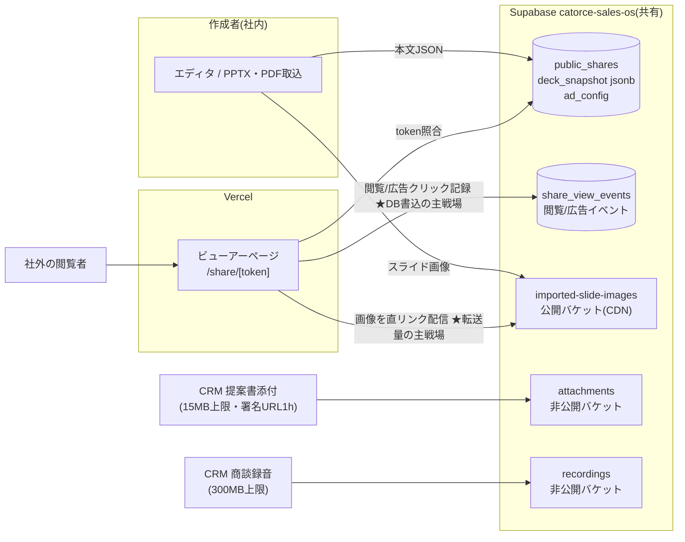
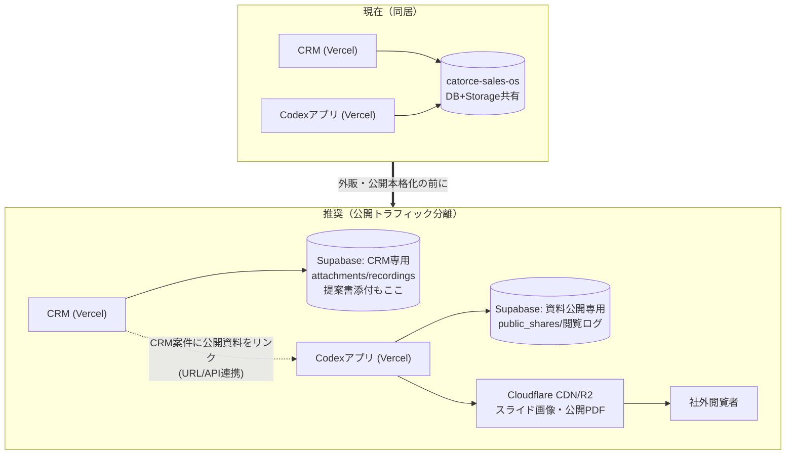

# ファイルストレージ分析 — 格納場所・容量逼迫時期・拡張性・コスト（2026-07-24）

> **目的**: 提案書・企画書・研修資料の作成/公開/ビューアー/広告分析アプリ（Codex開発）と、CRM側の提案書添付の両方を対象に、**「ファイルはどこに格納されているか」「容量はいつ逼迫するか」「拡張の柔軟性とコスト」**を、実環境の実測値に基づいて分析する。
> **調査方法**: 2026-07-24 に Supabase Management API / SQL でストレージバケット・テーブル・使用量を直接実測。推測ではなく現物の設定値。
> **姉妹文書**: `docs/INFRA_ANALYSIS_VERCEL_SUPABASE_2026-07.md`（全体インフラ分析）
> 為替は概算 $1=¥155。価格は2026年7月時点の公表値ベース概算、契約前に公式確認のこと。

---

## 0. エグゼクティブサマリー

| 問い | 答え |
|---|---|
| ファイルはどこにある？ | **CRMもCodexアプリも、同一のSupabaseプロジェクト `catorce-sales-os`（東京）のStorage** に格納。CRM=非公開バケット2つ（署名URL方式）、Codex=**公開(public)バケット1つ**（スライド画像を直リンク配信）。資料の本文データはStorageではなく**DBのJSONB列**（軽量、画像はバケット参照） |
| 今どれくらい使っている？ | **Storage合計 約56MB / DB 63MB**（まだガラガラ）。内訳: 商談録音48.7MB > スライド画像6MB > 添付1.6MB |
| いつ逼迫する？ | **容量(GB)より先に「転送量(egress)」が逼迫する**。Freeプランの転送枠 5GB/月は、公開ビューアーが本格稼働した瞬間（月1,000閲覧程度）に枯渇する。容量側はFreeの1GB枠が「録音の常用開始」または「PDFアップロード機能の公開」で数週間〜数ヶ月で到達 |
| 拡張の柔軟性は？ | Supabase Storageは**Pro化だけで容量100GB/転送250GBまで線形に拡張可**（追加も$0.021/GB・$0.09/GBと安い）。**本当のボトルネックは共有DB**: 閲覧ログが全閲覧でCRMと同じDBに書き込まれる構造で、ビューアーのバズ＝CRM障害（2026-07-12型）に直結 |
| コストの目安は？ | Pro化で月$25〜。閲覧10万回/月クラスでも月+3千円程度。**月100万閲覧級になったら公開配信だけCloudflare R2/CDNへ逃がす**（転送費ゼロ化）のが定石 |
| 最重要の提言は？ | **(1)** Pro化（転送5GB枠の解除が急務）**(2)** 閲覧ログの肥大対策（集計+ローテーション）**(3)** 外部公開トラフィックとCRMの**プロジェクト分離**（外販前）**(4)** PDFアップロード公開機能はCDN前提で設計 |

---

## 1. 実測: いま、どこに、何が、どう格納されているか

### 1.1 ストレージバケットの現物（2026-07-24 実測）

Supabaseプロジェクト `catorce-sales-os`（ap-northeast-1・Postgres 17）の `storage.buckets` / `storage.objects` を直接照会した結果:

| バケット | 公開設定 | ファイル上限 | 現在の使用量 | 所有アプリ | 用途 |
|---|---|---|---|---|---|
| `recordings` | **非公開** | 300MB/ファイル | **2件 / 48.7MB** | CRM (LiteCRM) | 商談録音音声。署名URLアップロード→文字起こしバッチ |
| `imported-slide-images` | **公開(public)** | 10MB/ファイル | 24件 / 6.1MB | **Codexアプリ**（2026-07-22作成、パス接頭辞 `codex/`） | 取込スライドの画像。公開ビューアーが直リンクで配信 |
| `attachments` | **非公開** | バケット上限なし（アプリ側で制御） | 1件 / 1.6MB | CRM (LiteCRM) | 案件/顧客への添付（上限10MB）・**提案書PDF（上限15MB）**・ナレッジ添付 |
| （DB本体） | — | — | **63MB / Free枠500MB** | 共用 | 下記1.2参照 |

**合計: Storage約56MB・DB 63MB。現時点で容量の危機はゼロ。** ただし後述の通り、危ないのは容量ではない。

### 1.2 「資料そのもの」はDBに入っている（Codexアプリの設計）

CodexアプリのデータはCRMと**同じ `public` スキーマに同居**しており、LiteCRMのマイグレーション管理外のテーブルが3つ存在する（実測で特定）:

| テーブル | 実測 | 役割 |
|---|---|---|
| `public_shares` | 2行 | 公開設定。`token`（公開URL）, `deck_snapshot`(**jsonb: 資料本文のスナップショット**), `ad_config`(jsonb: 広告設定), `basic_user`(簡易認証), `is_public` |
| `share_view_events` | 498行 / **736KB** | 閲覧・広告分析。`event_type`, `page_no`, `viewer_id/label`, `ip_hash`, `user_agent`, `referrer` — **1閲覧イベント≒1.5KB** |
| `company_research_targets` | 2,527行 / 3.5MB | （企業リサーチ。本分析の対象外） |

`deck_snapshot` の実測: **平均10KB/件・base64画像の埋め込みなし・画像は `imported-slide-images` バケット参照**。→ 資料本文は軽く、**重さはすべて画像/PDF（Storage側）と閲覧ログ（DB側）に発生する**構造。これは適切な設計。



### 1.3 セキュリティ面の所見（ファイル関連）

| 所見 | 深刻度 | 内容 |
|---|---|---|
| `public_shares` / `share_view_events` がRLS有効・**ポリシー0件** | 🟡 | 前回分析のアドバイザリ「rls_enabled_no_policy 2件」の正体。service_role経由でのみ操作する設計なら実害はないが、**anonキー経由のアクセス経路を今後作った瞬間に全件露出 or 全アクセス拒否**のどちらかになる。意図をコメント/ポリシーで固定すべき |
| `imported-slide-images` が**公開バケット** | 🟡 | 公開ビューアー用としては正しい選択（CDN配信・高速）。ただし**「限定公開」「Basic認証付き」の資料でも画像URLさえ知れば誰でも閲覧可能**（URLのUUIDによる難読化のみ）。機密資料を扱うなら非公開バケット+署名URL or 画像プロキシへの切替が必要 |
| CRM添付は非公開+署名URL(1h) | 🟢 | 適切。提案書添付(15MB上限)もこの方式。テナントIDをパス先頭に持つ構造でSaaS化にも耐える |
| 2アプリが同一DB・同一マイグレーション空間 | 🔴 | 後述 §4.1。**ファイル問題より先にこれが事故る** |

> 補足: 別プロジェクト `promptdeck`（INACTIVE・**ap-south-1ムンバイ**）はCodexアプリの旧試作と推定。復活させる場合はリージョンが東京でないため要注意（レイテンシ大）。`acube-poc` は `site` バケット1件のみで本件と無関係。

---

## 2. 容量はいつ逼迫するか — 枠と成長シナリオ

### 2.1 プラン別の「壁」の位置（Supabase）

| 資源 | Free（現状想定） | Pro ($25/月) | Pro超過時の単価 |
|---|---|---|---|
| DB容量 | **500MB** | 8GB込み | $0.125/GB/月 |
| Storage容量 | **1GB** | **100GB込み** | $0.021/GB/月（1TBでも+$21） |
| **転送量(egress)** | **5GB/月** ← 最初に壊れる壁 | **250GB/月込み** | $0.09/GB |
| 1ファイル上限 | **50MB**（全体上限） | 設定次第で最大50GB | — |
| 同時接続・CPU | 共有（07-12障害の原因） | 専有 | — |

※Vercel側: ビューアーのHTML/JSはVercel配信（Pro 1TB/月込み）だが、**画像・PDFの実体はSupabase直リンクなのでVercelの転送量はほぼ消費しない**。現構成はこの点で正しい。

### 2.2 成長シナリオ別・逼迫時期の試算

**前提となる1件あたりサイズ（実測+一般値）**: スライド画像 約250KB/枚（実測6.1MB/24枚）、1資料20枚≒5MB、アップロードPDF 5〜30MB、提案書添付 ≦15MB、商談録音 25〜50MB/件（実測24MB/件）、閲覧イベント1.5KB/行。

#### シナリオA: 現ペース（社内利用のみ）

| 資源 | 消費ペース | Free枠逼迫時期 |
|---|---|---|
| Storage | 資料10件/月(50MB) + 録音10件/月(300MB) | **約3ヶ月で1GB到達**（録音が主犯） |
| DB | 閲覧ログ微増 | 1年以上先 |
| 転送 | 社内閲覧のみ数GB | ギリギリ（既に危険水域） |

→ **録音機能を常用し始めた時点でFree脱落が確定する。**

#### シナリオB: 公開ビューアー本格稼働（外部に資料URL配布・広告表示開始）

| 閲覧規模 | 転送量/月（1閲覧≒5MB） | 閲覧ログ/月 | 判定 |
|---|---|---|---|
| 1,000 PV/月 | 5GB | 5千行(8MB) | **Freeの転送枠が即死**。Proなら余裕 |
| 10,000 PV/月 | 50GB | 5万行(75MB) | Pro込み枠内。DB書込負荷が見え始める |
| 100,000 PV/月 | 500GB | 50万行(750MB) | Pro超過 250GB×$0.09=**+$22.5/月**。ログのローテーション必須に |
| 1,000,000 PV/月 | 5TB | 500万行(7.5GB) | 超過$430/月 → **R2/CDN移行の損益分岐を超える**（§3.2）。DBログは集計テーブル化が必須 |

→ **公開機能の成否はStorage容量ではなく「転送量」と「閲覧ログのDB書込」で決まる。**

#### シナリオC: PDFアップロード公開機能のリリース後

| 利用規模 | Storage消費 | 逼迫時期 |
|---|---|---|
| 社内+一部顧客: 20 PDF/月 × 15MB | 300MB/月 | Free: 即月 / **Pro: 100GBまで約2.5年** |
| 外販・SaaSで開放: 500 PDF/月 × 15MB | 7.5GB/月 | Pro込み枠を**約13ヶ月**で消化 → 以降+$0.021/GBで実質無風（1TBでも+$21/月） |

→ **容量コストは恐れる必要がない。**注意点は2つ: ①Freeの**1ファイル50MB上限**（重い研修動画入りPDFが弾かれる。Proで引上げ可）②`attachments` バケットに**バケットレベルの上限が未設定**（アプリ側制御のみ。Codex側から同バケットを使う場合の防波堤として設定推奨）。

#### シナリオD: CRM提案書添付の本格利用

営業全員が全案件に提案書を添付しても 100案件/月×15MB=1.5GB/月 が上限想定。Proなら数年無風。**CRM側の添付はストレージ問題にならない**（署名URL方式なので転送も社内閲覧分のみ）。

### 2.3 結論 — 逼迫の順番

```
① 転送量5GB/月(Free) ← 公開ビューアー稼働で即・またはもう
② Storage 1GB(Free)  ← 録音常用 or PDF公開で数週間〜3ヶ月
③ DB 500MB(Free)     ← 閲覧ログ蓄積で徐々に（現在63MB）
------- ここまでは「Pro化($25)」だけで全部解決 -------
④ 転送250GB/月(Pro)  ← 10万PV/月超え。超過課金は軽微、100万PV級でR2検討
⑤ 共有DBの書込競合    ← 規模でなく「バズ」で突然来る。§4.1の分離が本質対策
```

---

## 3. 拡張の柔軟性とコスト

### 3.1 Supabase Storageの拡張性評価

| 観点 | 評価 | 内容 |
|---|---|---|
| 容量拡張 | ◎ | Pro化後は100GB込み・超過$0.021/GBの従量。**事前容量設計が不要**（申請・再構成なしで10TBまで線形） |
| 大容量ファイル | ○ | Proで1ファイル上限を引上げ可（設定値）。再開可能アップロード(TUS)対応済みなので動画級もOK |
| 配信性能 | ○ | 公開バケットはCDN配信（ProでSmart CDN）。**ただし転送量は課金対象のまま** |
| 画像最適化 | ○ | Image Transformation（リサイズ/WebP化）がPro以上で利用可。スライドサムネイル生成を自前実装しなくてよい |
| アクセス制御 | ◎ | 非公開+署名URL / 公開 / RLS連動の3方式を併用可能（現に併用中） |
| 可搬性 | ◎ | S3互換APIあり。**R2/S3への移行はオブジェクトコピーで済む**（ロックイン低） |

### 3.2 スケール時の選択肢とコスト比較（公開配信部分）

| 構成 | 月額コスト目安 | 切替タイミング |
|---|---|---|
| **現状+Pro**（Supabase直配信） | $25込み250GB、以降$0.09/GB<br>10万PV≒**$25〜48** | いま〜10万PV/月 |
| **+Cloudflare前段キャッシュ**（無料プランでも可） | Supabase転送が体感1/3〜1/10に圧縮<br>10万PV≒**$25+α** | 独自ドメイン化と同時にやってよい。設定のみで追加費ゼロ |
| **公開アセットをCloudflare R2へ移設** | R2: 保存$0.015/GB・**転送$0**<br>100万PV≒**$30前後**（Supabase比 -$400/月） | 30万〜100万PV/月、または広告ビジネスとして転送原価をゼロに固定したい時 |
| AWS S3+CloudFront | 転送$0.114/GB(東京)で**Supabaseより高い** | 単体では選ぶ理由なし（AWS全面移行時のみ） |

**要点**: 公開ビューアー+広告というビジネスは「閲覧が増えるほど転送原価が増える」構造。**Supabase Storageのままでも10万PV/月までは月数千円**で問題ないが、広告収益モデルを本気で回すなら**配信原価を固定費化できるR2が構造的に有利**。移行はS3互換APIのおかげで小さい（画像URLの張替えが主作業）。

### 3.3 閲覧ログ（DB側）の拡張設計

`share_view_events` は現在498行だが、**唯一「勝手に無限に増える」テーブル**。放置するとCRMと同居するDBを圧迫し、分析クエリも重くなる。推奨（10万PV/月に達する前に実装）:

1. **日次集計テーブル**（share_token × 日 × event_type × page_no の集計行）をバッチで生成 — ダッシュボードは集計を読む
2. **生ログは90日でパージ**（or 月次パーティション化してDROP）
3. 書込はビューアーAPIで**バッファリング/バッチINSERT**（1PVごとの単発INSERTを避け、共有DBへの書込圧を平準化）
4. 規模が進んだら分析基盤（BigQuery等）へのエクスポートに置換 — ただしそれは月100万PV級の話

---

## 4. 構造リスクと推奨アーキテクチャ

### 4.1 🔴 最重要: 「CRMとCodexアプリが同一Supabaseプロジェクト同居」の含意

実測で確認された通り、両アプリは**同じDB・同じ `public` スキーマ・同じStorage・同じ転送枠**を共有している。ファイル容量の話より先に、これが最大のリスク:

| リスク | シナリオ |
|---|---|
| 障害の道連れ | 公開ビューアーがSNS等でバズる → 閲覧ログINSERT殺到+画像転送集中 → **共有DBのCPU/コネクション枯渇 → CRM全画面停止**（2026-07-12障害の外部トリガ版。今度は自社で制御できない） |
| 枠の食い合い | ビューアーの転送量がSupabaseプロジェクト枠を消費 → **CRMの添付ダウンロードや画面まで遅延・課金増** |
| マイグレーション衝突 | LiteCRMは165本のマイグレーションを厳密管理しているが、Codex側のテーブル/バケットは**管理外で直接作成されている**（実測: `public_shares` 等3テーブル+1バケット）。将来、名前衝突・意図しないRLS変更・「どちらのアプリの変更か分からない」事故の温床 |
| 復旧粒度 | バックアップ/PITRはDB単位。**片方のアプリの事故復旧がもう片方のデータを巻き戻す** |

### 4.2 推奨ターゲット構成



**移行の考え方**:
- **今すぐ（Pro化と同時）**: 同居は継続でよいが、①Codex側のテーブル/バケットもマイグレーションファイル管理に載せる（責任分界の明文化）②`attachments` バケットに上限設定 ③閲覧ログの集計+パージ実装 ④公開バケット運用の機密ルール策定（機密資料は公開バケット禁止）
- **公開機能の対外ローンチ or 外販1社目まで**: 資料公開ワークロードを**別Supabaseプロジェクトへ分離**（Pro組織内の2プロジェクト目は約+$10/月〜）。「外部の不特定多数が叩く系」と「社内基幹系」の障害ドメインを切る
- **広告モデルの本格化（30万PV/月〜）**: 公開アセットをR2+Cloudflareへ。転送原価ゼロ化で広告ビジネスの限界利益を固定
- **CRM連携**: 提案書は「CRM添付（非公開・署名URL）」と「Codex公開資料（公開URL）」の2形態が併存する。CRM案件から公開資料のトークンURLを参照する**疎結合（リンク/API）**を推奨。DBを跨いだJOINが必要な設計にしない（分離を壊すため）

### 4.3 コストまとめ（ファイル関連の追加分）

| フェーズ | 構成 | ファイル関連の月額（インフラ全体でなく増分） |
|---|---|---|
| 現在 | Free同居 | ¥0（ただし転送5GB枠は既に危険水域） |
| Pro化直後 | Pro同居 | $25に込み（Storage 100GB/転送250GB） |
| 公開分離後 | Pro×2プロジェクト | +$10〜25 ≒ **+¥1,600〜4,000** |
| 10万PV/月 | 上記+転送超過 | +$0〜23 ≒ **+¥0〜3,600** |
| 100万PV/月 | R2移行後 | R2 $5前後 ≒ **+¥800**（Supabase直配信継続なら+$430≒¥67,000だった） |

---

## 5. アクションチェックリスト

| # | いつ | やること | 費用 |
|---|---|---|---|
| 1 | 今すぐ | Supabase Pro化（転送5GB/Storage1GB/共有CPU/1ファイル50MBの4つの壁を一括解除） | $25/月 |
| 2 | 今すぐ | Codexアプリのテーブル（`public_shares`/`share_view_events`）とバケットをマイグレーション管理下へ。RLSポリシー0件の意図を明文化 | ¥0 |
| 3 | 今すぐ | `attachments` バケットへ `file_size_limit` 設定。公開バケットに機密資料を置かない運用ルール | ¥0 |
| 4 | 早期 | 閲覧ログの日次集計+90日パージのバッチ実装（既存のVercel Cron基盤に1本追加） | ¥0 |
| 5 | 早期 | 独自ドメイン+Cloudflare前段（キャッシュで転送圧縮・WAF・広告配信の下地） | ¥0〜 |
| 6 | 公開本格化前 | 資料公開ワークロードを別Supabaseプロジェクトへ分離。CRMとはURL/APIの疎結合連携 | +$10〜25/月 |
| 7 | 30万PV/月〜 | 公開アセットをCloudflare R2へ移設（S3互換APIでコピー+URL張替え） | 実質減額 |

---

*実測値（バケット構成・使用量・テーブル・行数・スナップショットサイズ）はすべて2026-07-24にSupabase APIで取得。プラン枠・単価は公表値ベースの概算。*
