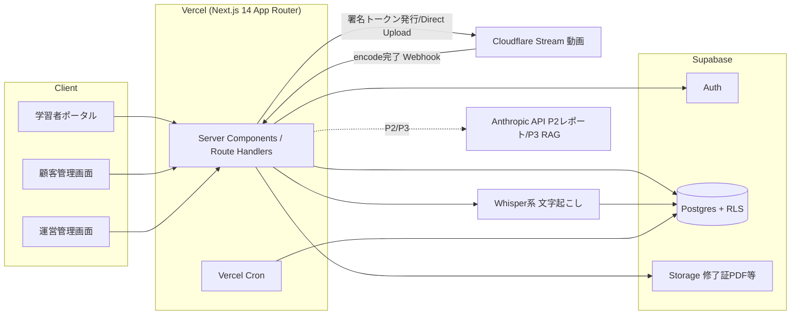
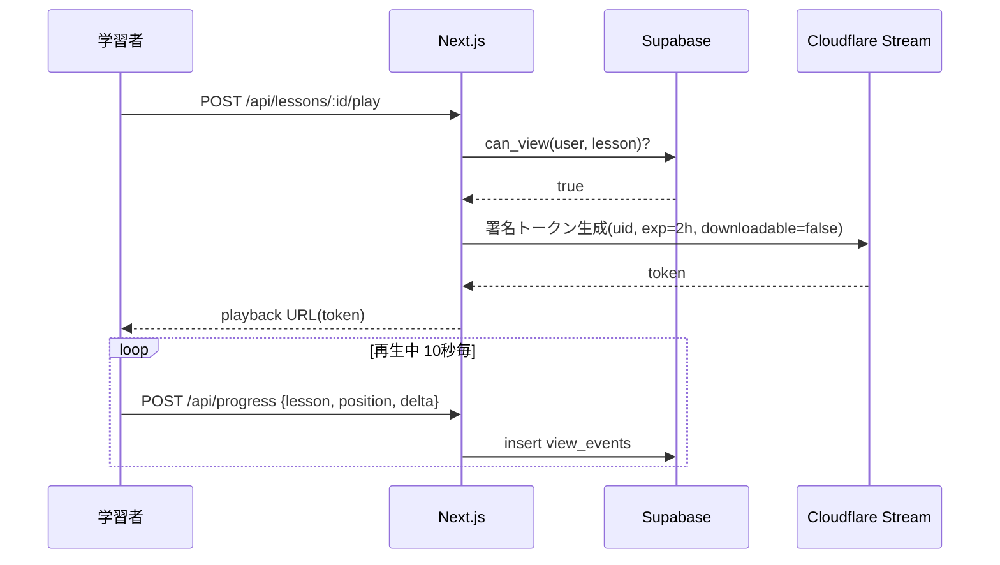

# CATORCE Learn 詳細設計書 v1.0

作成: 2026-07-25 ｜ 対応要件: `01_REQUIREMENTS.md`（FR/NFR番号は同書に対応）

## 1. システム構成



- 画面は1つのNext.jsアプリ内でロール別ルートグループ（`/(learner)` `/(tenant-admin)` `/(catorce-admin)`）
- 動画バイナリは一切自社インフラを通さない（アップロードもDirect Creator Upload）

## 2. データベース設計

### 2.1 テーブル定義（MVP・主要DDL）

```sql
-- テナント（顧客企業）
create table tenants (
  id uuid primary key default gen_random_uuid(),
  name text not null,
  plan text not null check (plan in ('archive','light','pro')),
  id_limit int not null default 30,                -- 契約バンドのID上限
  contract_start date not null,
  contract_end date,                                -- null=自動更新中
  status text not null default 'active' check (status in ('active','suspended','terminated')),
  litecrm_account_id uuid,                          -- LiteCRM accounts.id 参照キー(論理)
  note text,
  created_at timestamptz not null default now()
);

create table tenant_domains (                       -- FR-02 許可ドメイン
  tenant_id uuid not null references tenants(id) on delete cascade,
  domain text not null,
  primary key (tenant_id, domain)
);

-- プロフィール（auth.users 1:1）
create table profiles (
  id uuid primary key references auth.users(id) on delete cascade,
  tenant_id uuid references tenants(id),            -- catorce_adminはnull
  role text not null check (role in ('catorce_admin','tenant_admin','learner')),
  display_name text not null,
  department text,
  status text not null default 'active' check (status in ('active','disabled')),
  created_at timestamptz not null default now()
);

create table invitations (                          -- FR-02
  id uuid primary key default gen_random_uuid(),
  tenant_id uuid not null references tenants(id) on delete cascade,
  email text not null,
  role text not null default 'learner' check (role in ('tenant_admin','learner')),
  token text not null unique,
  expires_at timestamptz not null,
  accepted_at timestamptz,
  created_by uuid references profiles(id)
);

-- コンテンツ
create table courses (
  id uuid primary key default gen_random_uuid(),
  title text not null,
  description text,
  tier text not null check (tier in ('archive','light','pro')),  -- 視聴に必要な最低プラン
  tenant_id uuid references tenants(id),            -- null=共通/非null=テナント限定(研修アーカイブ)
  standard_minutes int not null,                    -- NFR-08 標準学習時間
  published_at timestamptz,
  sort int not null default 0
);

create table lessons (
  id uuid primary key default gen_random_uuid(),
  course_id uuid not null references courses(id) on delete cascade,
  title text not null,
  cf_video_uid text,                                -- Cloudflare Stream UID
  duration_seconds int,
  standard_minutes int,
  sort int not null default 0,
  transcript_status text not null default 'pending'
    check (transcript_status in ('pending','processing','done','failed'))
);

create table transcripts (                          -- NFR-09 RAGコーパス兼字幕
  lesson_id uuid primary key references lessons(id) on delete cascade,
  full_text text,
  segments jsonb                                    -- [{start,end,text}]
);

create table tags (
  id uuid primary key default gen_random_uuid(),
  kind text not null check (kind in ('tool','level','topic')),
  name text not null,
  unique (kind, name)
);
create table lesson_tags (
  lesson_id uuid references lessons(id) on delete cascade,
  tag_id uuid references tags(id) on delete cascade,
  primary key (lesson_id, tag_id)
);

-- 特典・個別許諾（FR-10/11）
create table entitlements (
  id uuid primary key default gen_random_uuid(),
  tenant_id uuid not null references tenants(id) on delete cascade,
  kind text not null check (kind in ('gift_archive','gift_light','gift_pro','trial')),
  starts_at date not null,
  ends_at date not null,
  source text,                                      -- 例: '研修特典(+2名条件) 商談ID xxx'
  created_by uuid references profiles(id)
);

-- 視聴ログ（FR-07 追記専用）
create table view_events (
  id bigint generated always as identity primary key,
  user_id uuid not null references profiles(id),
  lesson_id uuid not null references lessons(id),
  position_seconds int not null,
  seconds_delta int not null check (seconds_delta between 0 and 60),
  created_at timestamptz not null default now()
);

create table lesson_progress (                      -- 集計（バッチ/トリガで更新）
  user_id uuid not null references profiles(id),
  lesson_id uuid not null references lessons(id),
  max_position int not null default 0,
  watched_seconds int not null default 0,
  completed_at timestamptz,
  updated_at timestamptz not null default now(),
  primary key (user_id, lesson_id)
);
```

### 2.2 RLS方針（NFR-01/05）

- 全テーブル `enable row level security`
- 共通ヘルパー: `auth_tenant_id()`／`auth_role()`（JWTクレームから取得。profiles更新時にカスタムクレームを同期）
- 代表ポリシー:
  - `tenants`: catorce_adminのみ全件。tenant_adminは自テナントの参照のみ
  - `courses/lessons/transcripts`: learner/tenant_adminは「`tenant_id is null`（共通）または自テナント」かつ published のみ参照。書き込みはcatorce_adminのみ
  - `view_events`: **insertのみ許可（自分のuser_idのみ）。update/delete のポリシーを作らない**＝追記専用
  - `lesson_progress`: 本人はupsert可、tenant_adminは自テナント参照のみ
  - `profiles/invitations`: tenant_adminは自テナントのみ管理可。ドメイン制約はinsertトリガで検証
- クロステナント遮断はテスト仕様書 TC-SEC 群で全パターン検証する

### 2.3 視聴可否の判定関数（FR-06/11の中核）

```sql
create or replace function can_view(p_user uuid, p_lesson uuid) returns boolean ...
-- 判定順:
-- 1) profiles.status='active' かつ tenant.status='active'
-- 2) 契約期間内（contract_end is null or >= current_date）
--    または有効な entitlements が存在
-- 3) コースが共通(tenant_id is null)なら plan/entitlement の tier >= course.tier
--    テナント限定なら course.tenant_id = 自テナント
```

再生トークン発行APIはこの関数を必ず通す。日次バッチは期限切れtenants/entitlementsのstatus更新のみ行い、判定は常に実時間でも成立させる（二重化）。

## 3. API設計（Next.js Route Handlers）

| # | Method/Path | 概要 | 対応FR |
|---|---|---|---|
| A-01 | POST `/api/invitations` | 招待作成（ドメイン検証・ID上限チェック） | FR-02/12 |
| A-02 | POST `/api/invitations/accept` | トークン受諾→auth user作成→profile作成 | FR-02 |
| A-03 | POST `/api/admin/videos/upload-url` | Stream Direct Upload URL発行 | FR-05 |
| A-04 | POST `/api/webhooks/cloudflare` | エンコード完了→lessons更新→文字起こしジョブ投入 | FR-05/NFR-09 |
| A-05 | POST `/api/lessons/[id]/play` | can_view判定→署名付き再生トークン(TTL2h)返却 | FR-06 |
| A-06 | POST `/api/progress` | ハートビート受信（10秒毎/バッチ可）→view_events insert | FR-07 |
| A-07 | GET `/api/tenant/report?from&to` | テナント視聴状況CSV | FR-09 |
| A-08 | CRUD `/api/admin/tenants|courses|lessons|entitlements` | 運営管理 | FR-01/04/10 |
| A-09 | Cron `/api/cron/expire` (daily 00:10 JST) | 契約/特典期限切れの停止処理 | FR-11 |
| A-10 | Cron `/api/cron/aggregate` (hourly) | view_events→lesson_progress集計 | FR-07 |

### 再生シーケンス



## 4. 画面設計（MVP）

| 画面 | 主要素 |
|---|---|
| 学習者: コース一覧 | プランで視聴可能なコースのみ表示。続きから再生カード、累計学習時間 |
| 学習者: 再生 | Stream埋め込みプレーヤー、章立て（segments）、（P2で字幕） |
| 顧客管理: メンバー | 招待フォーム（ドメイン外はエラー）、ID利用数/上限バー、無効化 |
| 顧客管理: 視聴状況 | メンバー×コースのマトリクス（視聴率/学習時間）、期間指定、CSV |
| 運営: テナント | CRUD、プラン/ID上限/契約期間、特典発行（kind/期間/メモ） |
| 運営: コンテンツ | コース/レッスンCRUD、動画アップロード、タグ、公開状態、文字起こし状態 |

## 5. 外部サービス設計

- **Cloudflare Stream**: Direct Creator Upload / require signed URLs=on / ダウンロード無効。UIDのみDB保持。Webhookでencode完了受信（署名検証）
- **文字起こし**: encode完了後にジョブ（Vercel Queue/QStash か Supabase Edge Function）でWhisper系APIを実行し `transcripts` に保存。失敗時リトライ3回
- **Anthropic API（P2〜）**: 月次レポート講評生成。プロンプトと出力はテナント別に保存

## 6. Phase 2/3 拡張の受け口（MVPで作り込まない・塞がない）

- LiteCRM連携: `tenants.litecrm_account_id` を持つ。イベント連携はP2でoutboxテーブル＋Webhook
- RAG: transcriptsを最初から全量保存（NFR-09）。P3でpgvector拡張を有効化しsegments単位で埋め込み
- 外販: 料金・課金テーブルはMVPで作らない（請求は請求書運用）。tenantsのplan/id_limitが将来のStripe連携の写像になる設計だけ守る

## 7. エラー・例外方針

- 再生不可時はユーザー向けに理由を出し分け（契約外/プラン外/ID無効）し、tenant_adminへの導線を出す
- Webhook/cronは冪等に（cf_video_uid・日付キーでupsert）
- view_eventsのinsert失敗はクライアントで最大3回リトライ、それ以上は破棄（再生は止めない）
